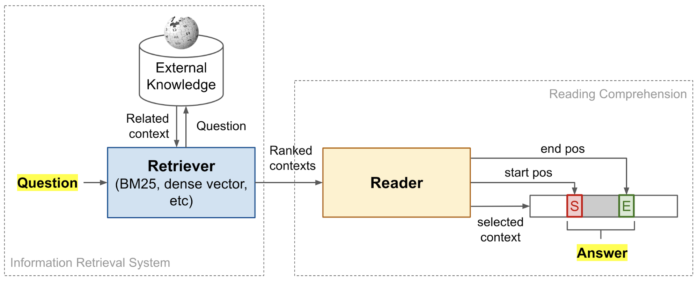
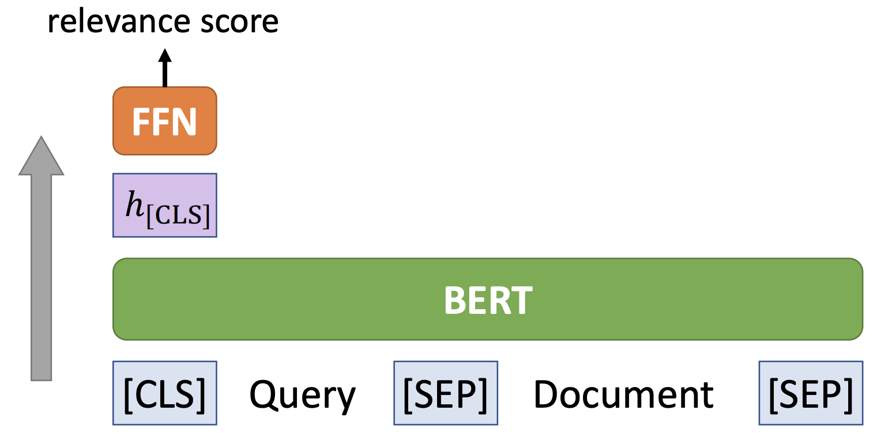
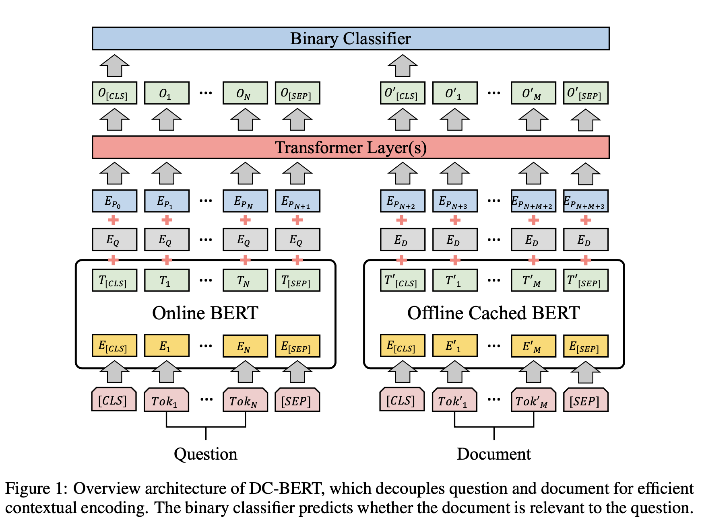
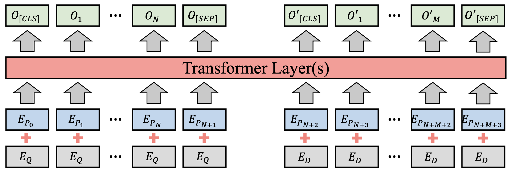
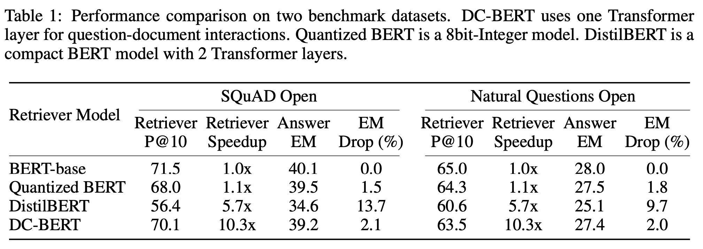
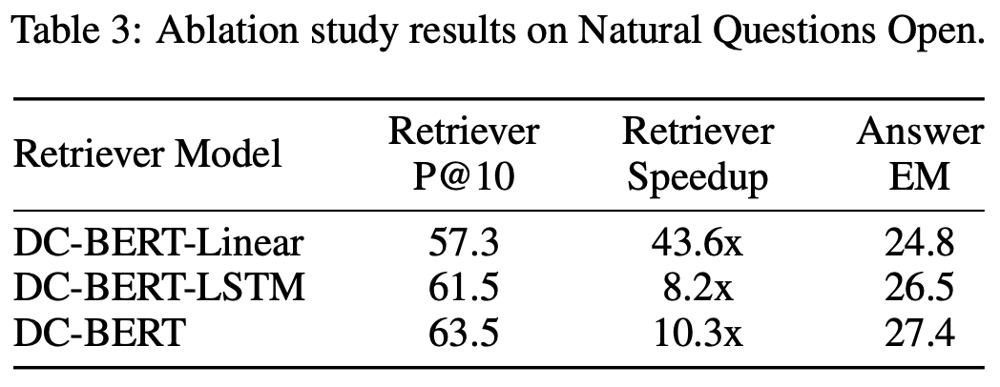
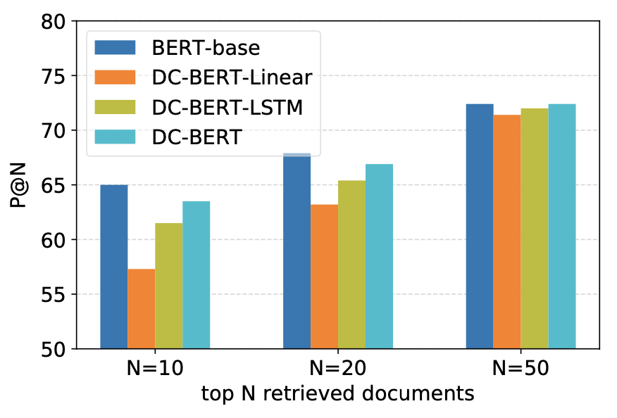
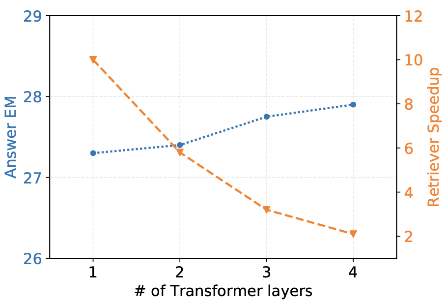
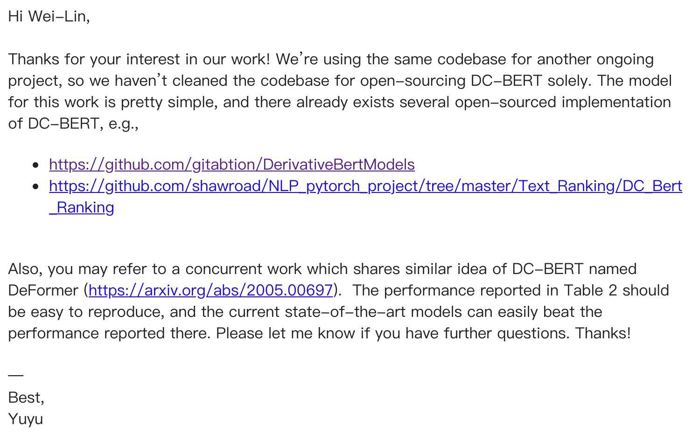

# DC-BERT: Decoupling Question and Document for Efficient Contextual Encoding <!-- .element: class="title" -->
## SIGIR 2020<!-- .element: class="subtitle" -->

2021.10.15  
Yu-Hung Wu @ Academia Sinica

https://arxiv.org/abs/2002.12591 <!-- .element: class="footnote" -->

---

## Outline

- Background
- Proposed Model
- Experiments
- Conclusion

---

## Background <!-- .element: class="section-title" -->

----

## Open-domain Question Answering

- This task requires a machine to find the answer by referring to large unstructured text corpora without knowing which documents may contain the answer.

- Previous works usually use RNN and CNN based approaches.

- With high-quality contextual encodings, BERT-based approaches have dominated the leaderboards and significantly outperformed previous approaches.

----

## Retrieve and Read

- Combines information retrieval (IR) and machine reading comprehension (MRC) modules.

- The former retrieves the documents using off-the-shelf IR systems based on TF-IDF or BM25, and the latter reads the retrieved documents to extract answer.

----

## Retrieve and Read

 <!-- .element: class="img95" -->

----

## Problems

- Classic model such as TF-IDF and Best Match Models have shallow understanding of the context. Thus, documents that contain the correct answer may not be ranked among the top by IR systems.

- We can't simply feed more documents into the reader module to increase the chance of hitting under-ranked documents that contain the answer, it can be computationally expensive.

----

## BERT-based Reranker for Retrieval

- A binary classifier to filter retrieved documents before feeding them into the reader module. 

 <!-- .element: class="img85" -->

----

## Problems

- Need to score all documents for a single query. 
  - Testing set: 80 queries * 100,000 docs = 8,000,000 computations

- This severe efficiency problem prohibits existing approaches for open-domain QA from being deployed as real-time QA systems.

- Such method can't outperform classic models

----

## My Previous Work

- Use BERT to rerank BM25 scores.

- Just rerank the top 1000 documents retrieved from BM25 model.

- Rescore the relavance score with

    $Score = 1 \times Score_{BM25} + Weight \times Score_{BERT}$

----

## My Previous Work - Results

| Method           | MAP@1000   |
| ---------------- | ---------- |
| BM25 + BERT      | **45.216** |
| BM25 only        | 39.136     |
| BERT only        | 30.248     |
| Random Documents | 0.007      |

----

## Mini Summary

- State-of-the-art approaches typically follow the “retrieve and read” pipeline

- Using classic models as the retrieval module is not enough, since such models have shallow understanding of the context

- However, use BERT to rerank the BM25 retreival can't even outperform the original BM25, and also time consuming

- We need a better solution

---

## Proposed Model <!-- .element: class="section-title" -->

----

## Basic Idea

- Two separate BERT models
  1. An online BERT which encodes the question only once
  2. An offline BERT which pre-encodes all the documents and caches their encodings

- The decoupled encodings of question and document are then fed into the Transformer layers with global position and type embeddings for question-document interactions.

----

## DC-BERT

 <!-- .element: class="img85" -->

----

## Dual-BERT component - Idea

- During training, the parameters of both BERT models are updated to optimize the learning objective.

- Once the model is trained, we pre-encode all the documents and store their encodings in an offline cache.

- During testing, we encode the question only once using the online BERT, and instantly read out the cached encodings of all the candidate documents.

----

## Dual-BERT component - Computation Complexity

- Naïve BERT method: *O(NqNd(Lq + Ld)2)*

- DC-BERT: *O(Nq(L2q + NdL2d))*

- DC-BERT(with cache): *O(NqL2q)*

Where Nq denote the number of questions, Nd denote the number of retrieved documents for each question, Lq and Ld denote the average number of tokens of each question and document, respectively.

----

## Transformer component

 <!-- .element: class="img90" -->

----

## Transformer component

- We obtain the question encoding T ∈ RN×d and the document encoding T′ ∈ RM×d. In this paper, we just concat the two embeddings directly.

- For the embedding layers, we have
  - Global position embeddings EPi ∈ Rd: Re-encode the token at position Pi in the concatenated question-document encoding sequence.
  - Segmentation Embeddings: To differentiate whether the encoded token is from question or document.

----

## Transformer component - Initialize

- Previous studies observed that the lower layers of BERT encode more local syntax information such as part-of-speech (POS) tags and constituents, while the higher layers tend to capture more complex semantics relying on wider contexts.
  
- It's reasonable to initialized the transformer layers by the last K layers of pre-trained BERT, and are updated during the training.

----

## Classifier component

- DC-BERT treats the document reranking task as a binary classification problem to predict whether the retrieved document is relevant to the question.

- We parameterize the binary classifier as a MLP layer on top of the Transformer layers:
    

---

## Experiments <!-- .element: class="section-title" -->

----

## Benchmark Datasets

1. SQuAD-Open: Composed of questions from the original crowdsourced SQuAD dataset.

2. Natural Questions Open: Composed of questions from the original Natural Questions dataset.

----

## Evaluation Metrics

- Retriever speedup: Running on a single GPU.

- Retriever ranking performance:

  1. P@N: The percentage of questions for which the answer span appears in one of the top N documents. i.e. $	\frac{r}{n}$ , where n can be chosen based on an assumption about how many documents the user will view.
  
----

## Evaluation Metrics

  2. PBT@N: The percentage of questions for which at least one of the top N documents that contains the answer span is not in the TF-IDF top *N* documents.
       - The higher the better

  3. PTB@N: the percentage of questions for which at least one of the top N TF- IDF retrieved documents that contains the answer span not in the retriever’s top *N* documents.
       - The lower the better

----

## Evaluation Metrics

  4. To evaluate the downstream QA performance, the paper uses exact match (EM) score. This  metric  measures  the  percentage of predictions that match any one of the ground truth answers exactly.

----

## Baseline

1. BERT-base: A well-trained reranker using the BERT-base model.

2. Quantized BERT: A compressed BERT-base model.

3. DistilBERT: Leverages knowledge distillation techniques (Hinton et al., 2015) to train a smaller and compact student BERT model.

----

## Results

 <!-- .element: class="img100" -->

----

## Results

 <!-- .element: class="img100" -->

----

## Ablation Study

- Replace the transformer layer with:
    1. linear layers (DC-BERT-Linear)
    2. LSTM layer (DC-BERT-LSTM)

 <!-- .element: class="img80" -->

----

## Ablation Study

- Different number of retrieved documents & model architecture

 <!-- .element: class="img80" -->

----

## Ablation Study

- Different number of transformer layers

 <!-- .element: class="img80" -->

---

## Conclusion <!-- .element: class="section-title" -->

----

## Conclusion

- This paper introduces DC-BERT to decouple question and document for efficient contextual encoding.

- DC-BERT has been successfully applied to document retrieval, a key component in opendomain QA, achieving 10x speedup while retaining most of the QA performance.

----

## Conclusion

 <!-- .element: class="img90" -->