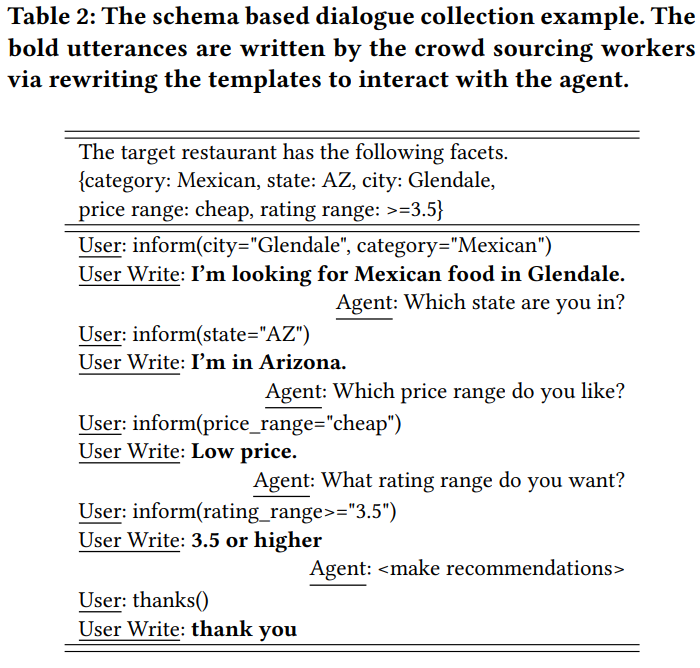
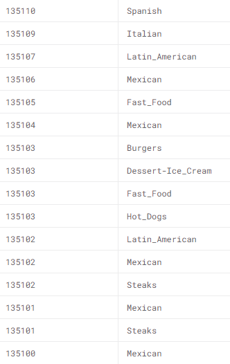

# Progress Report - 20210707 <!-- .element: class="title" -->
## Surveying... <!-- .element: class="subtitle" -->

<div class="title-name">
2021.07.07 <br>
Yu-Hung, Wu
</div>

---

## Outline

- Read a paper (Conversational Recommender System) & Recommendation Systems
- Dataset
- Experiment
- Future Work

---

## Dataset  <!-- .element: class="section-title" -->

----

## Paper's Approach

- Use Yelp's Recommendation dataset
- Lack of Dialogue utterances
- Solution: create a dataset using Amazon Mechanical Turks, and get 385 sets

----

## Paper's Approach.

- Delexicalization
    - Not a word...
    - Match the target values back to the written utterances, and substitute them with the placeholders, e.g. location, price...
    - Thus get 2275 times more dialogue sets (875721)

----

## Paper's Approach..



----

## Candidate Dataset (1)

- "Restaurant Data with Consumer Ratings" from Kaggle
- Attributes included rating, location, category...etc.



----

## Candidate Dataset (2)

- Yelp Dataset
- Including restaurants' information and customers' consuming records

```json
"root":{
"business_id":string"6iYb2HFDywm3zjuRg0shjw"
"name":string"Oskar Blues Taproom"
"address":string"921 Pearl St"
"city":string"Boulder"
"state":string"CO"
"postal_code":string"80302"
"latitude":float40.0175444
"longitude":float-105.2833481
"stars":int4
"review_count":int86
"is_open":int1
"attributes":{22 items
"RestaurantsTableService":string"True"
"WiFi":string"u'free'"
"BikeParking":string"True"
"BusinessParking":string"{'garage': False, 'street': True, 'validated': False, 'lot': False, 'valet': False}"
"BusinessAcceptsCreditCards":string"True"
"RestaurantsReservations":string"False"
"WheelchairAccessible":string"True"
"Caters":string"True"
"OutdoorSeating":string"True"
"RestaurantsGoodForGroups":string"True"
"HappyHour":string"True"
"BusinessAcceptsBitcoin":string"False"
"RestaurantsPriceRange2":string"2"
"Ambience":string"{'touristy': False, 'hipster': False, 'romantic': False, 'divey': False, 'intimate': False, 'trendy': False, 'upscale': False, 'classy': False, 'casual': True}"
"HasTV":string"True"
"Alcohol":string"'beer_and_wine'"
"GoodForMeal":string"{'dessert': False, 'latenight': False, 'lunch': False, 'dinner': False, 'brunch': False, 'breakfast': False}"
"DogsAllowed":string"False"
"RestaurantsTakeOut":string"True"
"NoiseLevel":string"u'average'"
"RestaurantsAttire":string"'casual'"
"RestaurantsDelivery":string"None"
}
"categories":string"Gastropubs, Food, Beer Gardens, Restaurants, Bars, American (Traditional), Beer Bar, Nightlife, Breweries"
"hours":{7 items
"Monday":string"11:0-23:0"
"Tuesday":string"11:0-23:0"
"Wednesday":string"11:0-23:0"
"Thursday":string"11:0-23:0"
"Friday":string"11:0-23:0"
"Saturday":string"11:0-23:0"
"Sunday":string"11:0-23:0"
}
}

```

---

## Experiment  <!-- .element: class="section-title" -->

----

## User's utterances

```json
{
        "user_id": "Yej5B4nd8PqpHMQcmCTDrg",
        "business_id": "jsuUmIEefPjV__ads62Z5w",
        "stars": "3.0",
        "content": [
            {
                "slots": {
                    "categories": "New Mexican Cuisine",
                    "city": "Phoenix"
                },
                "nl": "I need New Mexican Cuisine food in Phoenix"
            },
            {
                "slots": {
                    "price": "low"
                },
                "nl": "low"
            },
            {
                "slots": {
                    "state": "AZ"
                },
                "nl": "AZ"
            },
            {
                "slots": {
                    "stars": "4.5"
                },
                "nl": "4.5 stars"
            }
        ]
    }
```

----

## Simulate a Dialogue

```text
UserName: Ij7OcAO5FpoNKxS1RzNoWw, Target: 83cVpTJNyzv9lJ20vzBgdg
Turn 1 agent: What kind of food do you like?
Turn 1 user: Pizza food
Turn 2 agent: Which city are you in?
Turn 2 user: In Phoenix
Turn 3 agent: Which state are you in?
Turn 3 user: AZ
Turn 4 agent: Which rating range do you like?
Turn 4 user: 4.0
Turn 5 agent: Which price range do you want?
Turn 5 user: lowest price
Turn 6 agent: recommend
['WWWufR135GEXKynwYjLdGg', '83cVpTJNyzv9lJ20vzBgdg', 'fgfv-Fsk_-r8x5d4i9tLOQ']
Conversation Over: Success, Target 2/3
```

- 成功的對話，Target在recommendation list裡面

---

## Next...

- Datasets
- Study Factorization Machine (FM) Model & other recommendation methods
- Continue reading "A Survey on Conversational Recommender Systems"
- Code tracing