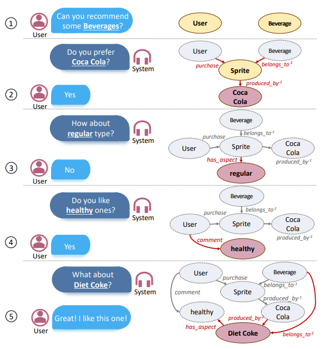

# Progress Report - 20210714 <!-- .element: class="title" -->
##  Continue Surveying...<!-- .element: class="subtitle" -->

2021.07.14  
Yu-Hung, Wu

---

## Outline

- Read papers
    1. A Knowledge-Grounded Neural Conversation Model [[Notion notes]](https://www.notion.so/Conversational-Recommender-System-177b2aa611ba42cb85d6a05f2e57dfeb)
    2. A Dataset of Real Dialogues for Conversational Recommender Systems (Candidate dataset #4 of last week)
    3. A Survey on Conversational Recommender Systems
- Find an additional dataset
- Todo

---

## Datasets  <!-- .element: class="section-title" -->

----

## Candidate Dataset #5

- The "COOKIE dataset" (Nov. 2020, cited by 5)
- A Dataset for conversational recommendation over KGs in E-commerce
- The dataset is constructed from an Amazon review corpus by integrating both user–agent dialogue and custom knowledge graphs for recommendation.
- Still under investigating...

https://arxiv.org/abs/2008.09237 <!-- .element: class="footnote" -->

----

## Candidate Dataset #5.

 <!-- .element: class="img60" -->

---

## Todo

1. Continue reading papers
2. Study T5, KG
3. Compare the 5 datasets currently found
4. Code tracing