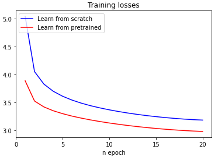
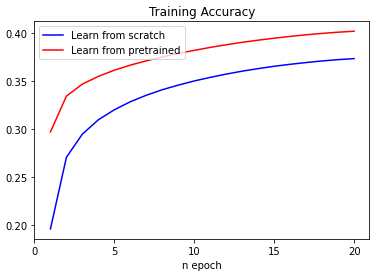
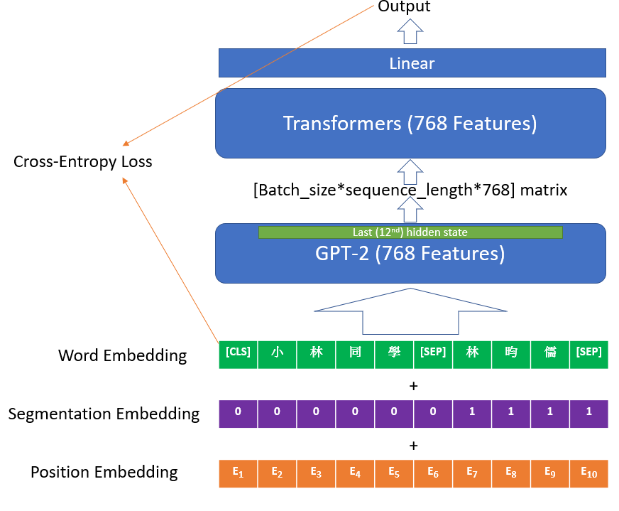

# Progress Report - 20210803 <!-- .element: class="title" -->
##  GPT2 + Transformers <!-- .element: class="subtitle" -->

<div class="title-name">
2021.08.03 <br>
Yu-Hung, Wu
</div>

---

## Outline

- GPT2 chatbot experiment results
- GPT2 + Transformers

---

## GPT2 chatbot experiment results  <!-- .element: class="section-title" -->

----

## Datasets

- Dataset size
    1. Learn from scratch: *500K* multi-turn dialogs
    2. Learn from pretrained: 500K multi-turn dialogs
- Pretrained model = "ckiplab/gpt2-base-chinese"

----

## Training Loss

* avg. loss of Learning from scratch: 3.4980877895750653
* avg. loss of Learning from pretrained: 3.1899377315175235

 <!-- .element: class="img60" -->

----

## Training Accuracy

* Accuracy for the last epoch of Learning from scratch: 0.3731045458688278
* Accuracy for the last epoch of Learning from pretrained: 0.4016490467859501

 <!-- .element: class="img60" -->

----

## Demo - Learning from *Scratch*

```
user:台南的食物到底為什麼那麼甜呀
chatbot:哈哈哈哈哈哈哈
user:明天就要去比賽了
chatbot:好的好的，加油加油。
user:我覺得我們沒辦法復合
chatbot:嗯嗯，一起加油吧
user:以後有時間再見面
chatbot:好好聊聊
user:大谷翔平被三振兩次 笑死
chatbot:我是大谷翔平
user:我從來不去想結局會是怎樣
chatbot:你說的話我也是一定要去看看
user:也從不在意別人的眼光
chatbot:我不在意你
user:就算我會一無所有
chatbot:你會回頭的
user:去到了一個全新世界
chatbot:哈哈哈哈哈
user:把你放在心中
chatbot:你的心在那裡，我不怕
user:頭也不回的人 是我
chatbot:不是我
```

----

## Demo - Learning from *pretrained*

```
user:我明天要去爬山
chatbot:我今天下午去爬了一天爬了個小時
user:那現在一定很累
chatbot:我今天去的時候就累的不行了
user:最近吃太多芒果了 臉部一直發炎
chatbot:吃了火鍋就好了。
user:好久沒去吃火鍋了
chatbot:是的，好久了
user:大谷翔平被三振兩次 笑死
chatbot:我也笑了哈哈哈哈哈哈哈哈哈哈哈
user:台灣贏中國隊了耶
chatbot:沒有，我也很無奈啊
```

---

## GPT2 + Transformer <!-- .element: class="section-title" -->

----

## Figure

 <!-- .element: class="img80" -->

----

## Progress

* Batch size = 4, ~140 mins per epoch
* Still training
* Converge slower than GPT-2 models