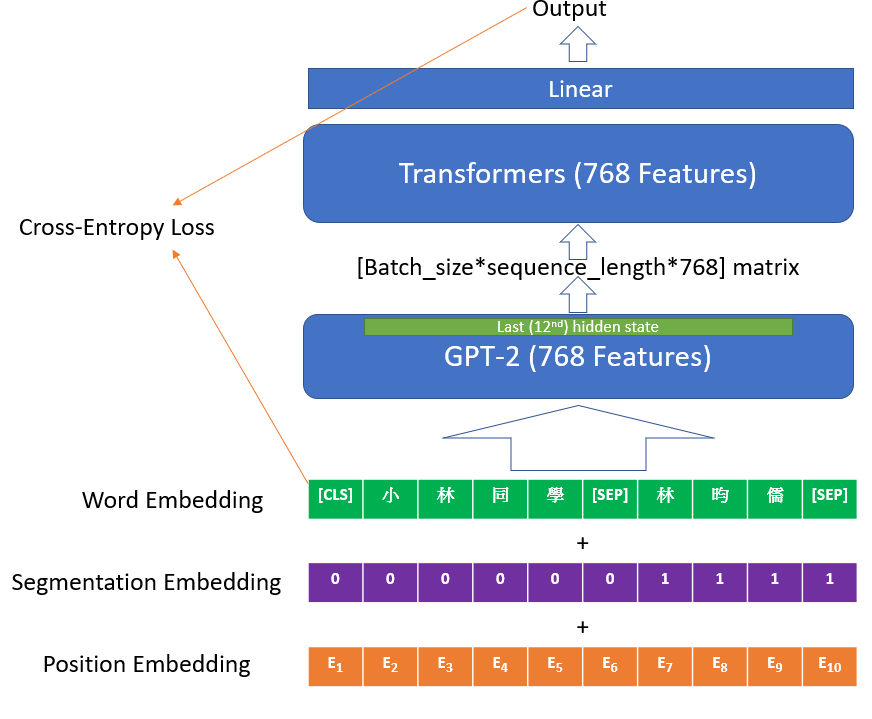
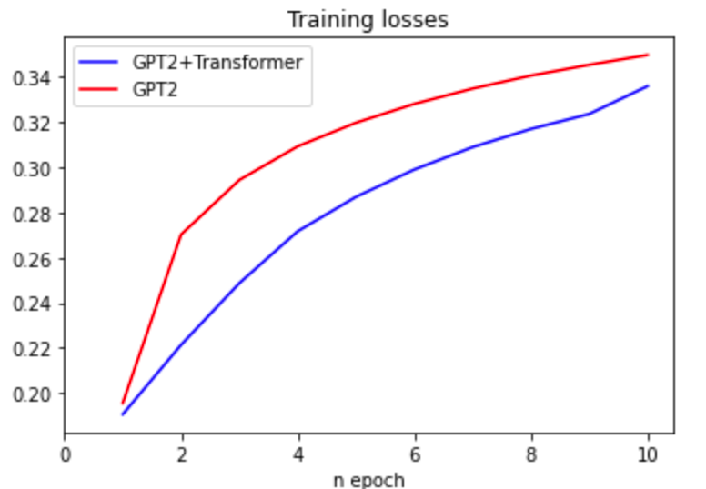
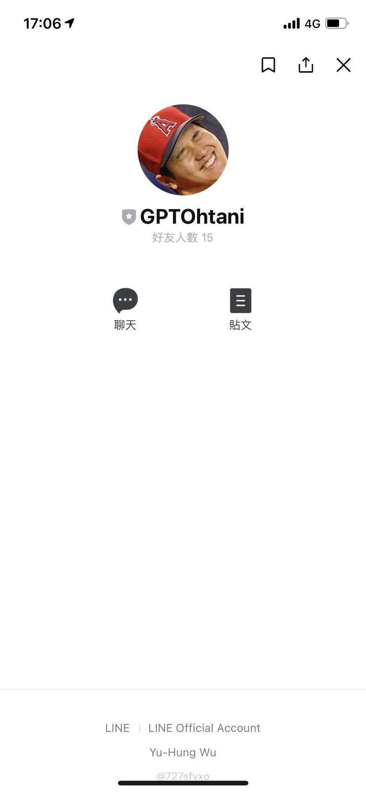
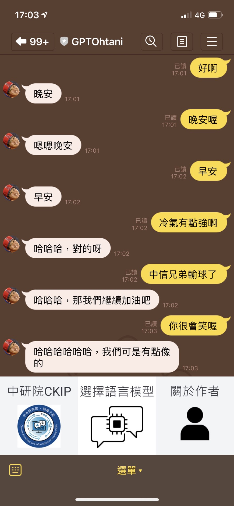
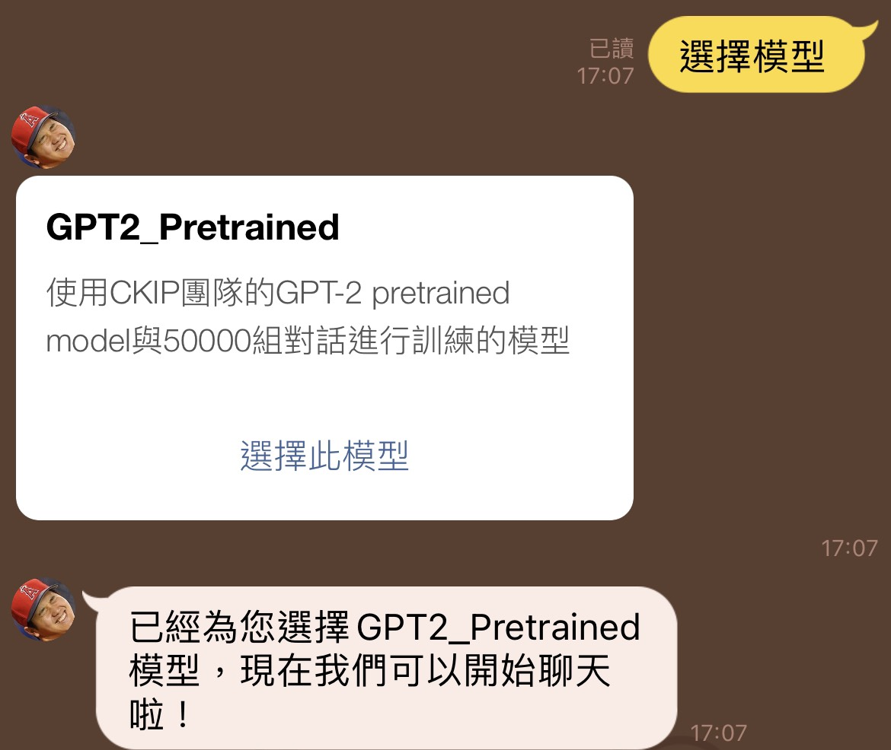

# Progress Report - 20210811 <!-- .element: class="title" -->

2021.08.11  
Yu-Hung, Wu

---

## Outline

- GPT2 + Transformers
- Linebot
- Webdemo

---

## GPT2 + Transformers  <!-- .element: class="section-title" -->

----

## Architecture

 <!-- .element: class="img80" -->

----

## Progress

- load_state_dict() does not work in my model (maybe the tensor size error), so it couldn't connect to linebot
- 3 layers for transformer encoder & decoder - TRAINING
    - Acurracy: Significantly better than the previous model
    - Loss: Converge faster than the previous model

----

## GPT-2 vs. GPT-2 + Transformer

---

## Linebot <!-- .element: class="section-title" -->

----

## Screenshot

 <!-- .element: class="img30" -->

----

## Screenshot.

 <!-- .element: class="img30" -->

----

## Screenshot..

----

## Features

1. Admins can Add models at anytime, and the flow is extremely simple
2. Users can change the model anytime
3. Chat history is stored at database.
4. Backend control panel

----

## Todo

- Refresh the dialogue

---

## Linebot <!-- .element: class="section-title" -->

- Refresh the dialogue