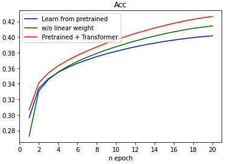
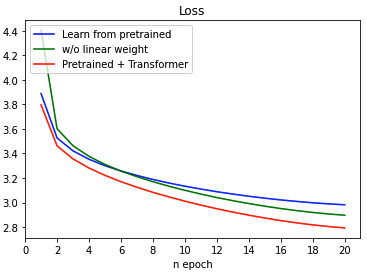
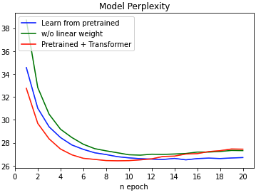

# Progress Report - 20210818 <!-- .element: class="title" -->
##  <!-- .element: class="subtitle" -->

2021.08.18  
Yu-Hung, Wu

---

## Outline

- Training Results
- Maximum Mutual Information Scoring Function (MMI)
- Perplexity w/ strides

---

## Training Results  <!-- .element: class="section-title" -->

----

## Three Training Methods

1. Use ckiplab/gpt2-base-chinese as pretrained model (blue line)
2. Use ckiplab/gpt2-base-chinese as pretrained model and add 3 transformer layers on the top of GPT-2 (green line)
3. Use ckiplab/gpt2-base-chinese as pretrained model and add 3 transformer layers on the top of GPT-2; for the uppermost linear layer, use the pretrained weight in GPT-2 linear layer(red line)

----

## Results - Accuracy

 <!-- .element: class="img75" -->

----

## Results - Loss

 <!-- .element: class="img75" -->

----

## Results - Perplexity

 <!-- .element: class="img75" -->

----

## Results - Perplexity.

- Minimum of learn from pretrained: 26.5140
- Minimum of pretrained+transformer w/o linear weight: 26.9230
- Minimum of pretrained+transformer w/ linear weight: ***26.4309***

---

## Maximum Mutual Information Scoring Function (MMI) <!-- .element: class="section-title" -->

https://arxiv.org/abs/1911.00536 <!-- .element: class="footnote" -->

----

## Maximum Mutual Information Scoring Function (MMI)

- From *DialoGPT: Large-Scale Generative Pre-training for Conversational Response Generation* (MS research group)
- Solved the problem that the response was sometimes too bland or uninformative

----

## Maximum Mutual Information Scoring Function (MMI).

- Given a dialogue in the training set:
  - A: How are you?
  - B: I'm fine, thanks. And you?
  - A: Great!

- To train the target model, we use the following as input:
  - [CLS]How are you?[SEP]I'm fine, thanks. And you?[SEP]Great![SEP]

----

## Maximum Mutual Information Scoring Function (MMI).

- Now, we train an additional "MMI model". The model's goal is to predict source sentences from given responses. Thus, the input is the reversed sentence of the original model:
  - [CLS]Great![SEP]I'm fine, thanks. And you?[SEP]How are you?[SEP]

----

## Maximum Mutual Information Scoring Function (MMI)..

- To use the MMI model:
    1. Use the target model to generate a set of responses, we denote it as *S*
    2. for each response in *S*, use the MMI model to calculate it's perplexity. The input is backwarded:
        - [CLS]response[SEP]Great![SEP]I'm fine, thanks. And you?[SEP]How are you?[SEP]
    3. Choose the one with least perplexity, this is the final response