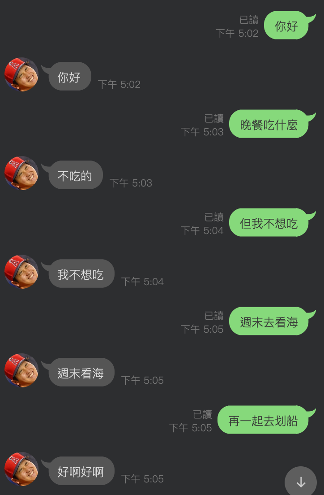
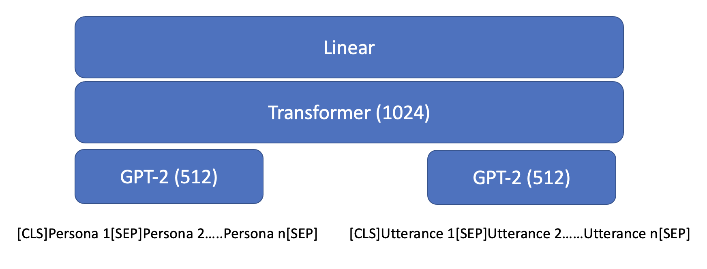

# Progress Report - 20210825 <!-- .element: class="title" -->
##  <!-- .element: class="subtitle" -->

<div class="title-name">
2021.08.25 <br>
Yu-Hung, Wu
</div>

---

## Outline

- MMI model experiments
- The PERSONA-CHAT dataset
- 

---

## MMI model experiments  <!-- .element: class="section-title" -->

----

## w/o the MMI model (#9 epoch)

 <!-- .element: class="img45" -->

----

## w/ the MMI model (#9 epoch, lowest perplexity)

```
user:你好
chatbot:你好！
user:晚餐吃什麼
chatbot:哈哈哈，好久沒吃了，還在想
user:但我不想吃
chatbot:那你就是想吃了，我也是
user:週末去看海
chatbot:你們週末不是要上班嗎，週末不去啊
user:再一起去划船
chatbot:那你要提前告訴我，我們週一要去
```

----

## w/ the MMI model (#20 epoch, lowest training loss)

```
user:你好
chatbot:你好，我是新浪的
user:晚餐吃什麼
chatbot:這個就不知道了哈哈哈
user:但我不想吃
chatbot:那就不吃，我要去做，哈哈哈哈
user:週末去看海
chatbot:哈哈哈哈你不上班啊？
user:再一起去划船
chatbot:哈哈哈哈哈我也想啊
```

---

## The PERSONA-CHAT dataset   <!-- .element: class="section-title" -->

https://parl.ai/ <!-- .element: class="footnote" -->

----

## Example Dialogue

|               A's persona               |           B's persona           |
| :-------------------------------------: | :-----------------------------: |
|              I like to ski              |         I am an artist          |
|    My wife does not like me anymore     |      I have four children       |
| I have went to Mexico 4 times this year |      I recently got a cat       |
|           I hate Mexican food           |  I enjoy walking for exercise   |
|          I like to eat cheetos          | I love watching Game of Thrones |


----

## Example Dialogue.

```txt
A: Hi
B: Hello ! How are you today?
A: I am good thank you , how are you.
B: Great, thanks ! My children and I were just about to watch Game of Thrones.
A: Nice ! How old are your children?
B: I have four that range in age from 10 to 21. You?
A: I do not have children at the moment.
B: That just means you get to keep all the popcorn for yourself.
A: And Cheetos at the moment!
B: Good choice. Do you watch Game of Thrones?
A: No, I do not have much time for TV.
B: I usually spend my time painting: but, I love the show.
```

----

## Statistics

- 8939 training dialogs, 1000 valid dialogs, 968 testing dialogs
- 4-5 personas for both turkers in each dialog
- maximum of 15 words for each utterance
- Still preprocessing

----

## Todo

 <!-- .element: class="img90" -->

- Meeting room?
- Paper