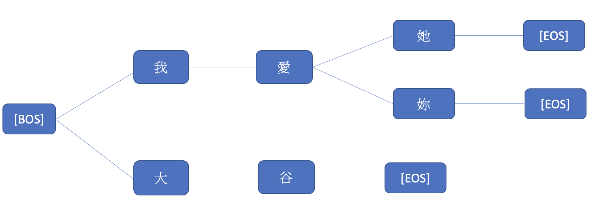
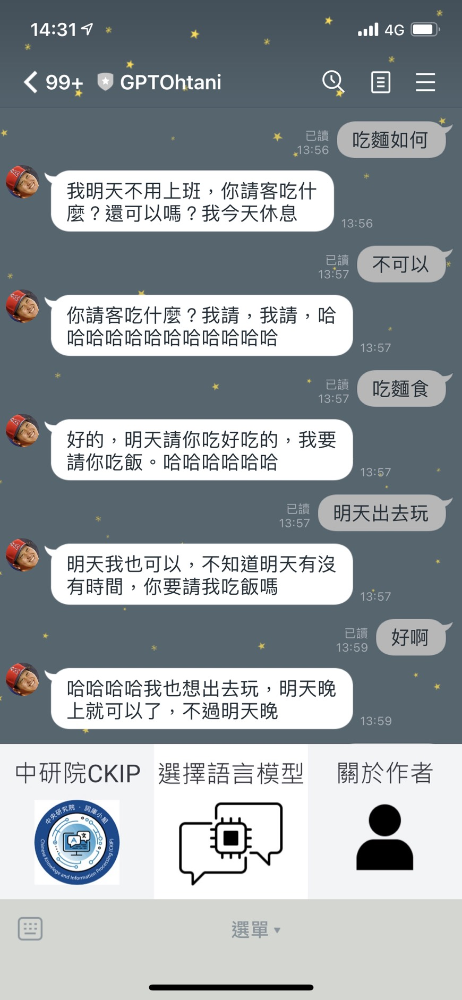
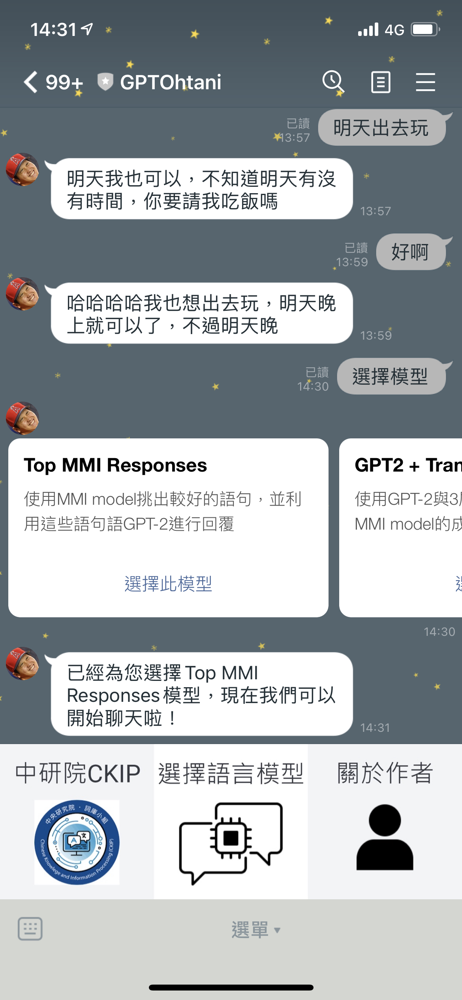

# Mini Progress Report - 20210901 <!-- .element: class="title" -->
## Using Utterances with Top MMI Scores for Response<!-- .element: class="subtitle" -->

<div class="title-name">
2021.09.01 <br>
Yu-Hung, Wu
</div>


Available on "GPTOhtani" Linebot<!-- .element: class="footnote" -->

---

## Outline

- Method
- Results
- Linebot

---

## Method  <!-- .element: class="section-title" -->

----

## Select Top N MMI Dialogs

- Dialogs with *extremely* low MMI loss are sometimes outliers, so I didn't use the first 10000 dialogs
- Instead, I chose No.50000~60000 dialogs for valid responses.
- There are about 40000 utterances for total

----

## Build the tree

- Using linked list to build a tree, each path represents an utterance
 <!-- .element: class="img90" -->

----

## Prediction

- For the output logits of the GPT-2 + transformer model, the length is the voabulary size
- Except for the children of the current node, other words in the output logits are masked (thus can't be predicted)
- So, the response must be one of the paths in the tree.

---

## Results  <!-- .element: class="section-title" -->

----

## Example Dialogue 1

```
user:明天去爬山
chatbot:不敢去，怕捱揍
user:不要怕我保護你
chatbot:你就算啦
user:那晚上要吃什麼
chatbot:我要吃糖
user:一起吃嗎
chatbot:好啊好啊
```

----

## Example Dialogue 2

 <!-- .element: class="img30" -->

---

## Linebot <!-- .element: class="section-title" -->

----

## The Model is Available on Linebot (Top MMI Responses)

 <!-- .element: class="img30" -->