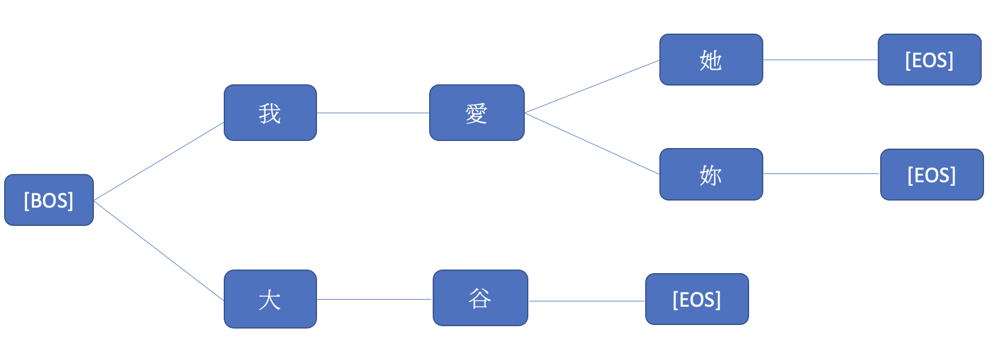

# Progress Report - 20210908 <!-- .element: class="title" -->
##  <!-- .element: class="subtitle" -->

2021.09.08  
Yu-Hung, Wu

---

## Outline

- Limited Reference
- Todo: MMI Testing

---

## Limited Reference  <!-- .element: class="section-title" -->

----

## Select Top N MMI Dialogs

- Dialogs with *extremely* low MMI loss are sometimes outliers, so I didn't use the first 10000 dialogs
- Instead, I chose No.50000~60000 dialogs for valid responses.
- There are about 40000 utterances for total

----

## Build the tree

- Using linked list to build a tree, each path represents an utterance
 <!-- .element: class="img90" -->

----

## Prediction

- For the output logits of the GPT-2 + transformer model, the length is the voabulary size
- Except for the children of the current node, other words in the output logits are masked (thus can't be predicted)
- So, the response must be one of the paths in the tree.

---

## Todo: MMI Testing <!-- .element: class="section-title" -->

----

## Motivation

- To find whether the MMI model has the ability to predict P(Source|Target)
- To investigate why bland responses can predict source sentences

----

## Dataset

- Define Continuous actions, for example:
    - ("把冰箱門打開", "把冰箱清空", "把大象放進冰箱", "把冰箱門關起來")
    - ("把菜盤拆開", "把芋頭拿出來", "把其他菜放進火鍋", "把菜從火鍋夾出來")
- Define templates
    - "我已經{}", "那就{}吧！"
- Use consecutive elements in actions to format the dataset 

---

## Todo: Investigate GPT-2 Attentions <!-- .element: class="section-title" -->