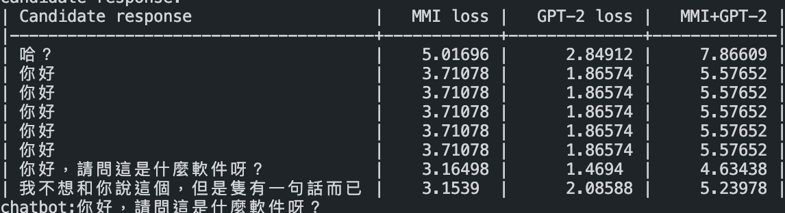

# Progress Report - 20210924 <!-- .element: class="title" -->

<div class="title-name">
2021.09.24 <br>
Yu-Hung, Wu
</div>

---

## Outline

- MMI combined with GPT-2 loss
- Attention weights

---

## MMI combined with GPT-2 loss <!-- .element: class="section-title" -->

----

## Idea

- In addition to the MMI model, combine the GPT-2 loss (forward loss) to sort the candidate responses
- Consider forward order and reverse order simultaneously
- Observation: GPT-2 loss states for a improved Logical filter

----

## Example

 <!-- .element: class="img95" -->

---

## Attention Weights <!-- .element: class="section-title" -->

----

## Idea

- When the users change the topic in a dialogue, chatbots often didn't reflect instantly (Live in their own world)
- We can try to control attentions in the transformer, so that the model can focus on more recent responses
- Add weight to attention scores may be a solution

----

## Method

- The dimension of q is (sequence length, head length), k is (head length, sequence length)
- Attention score q * k will be a (sequence length, sequence length) matrix
- Add a attention weight matrix (sequence length, sequence length) and multiply with the attention score
- Attention weight matrix will be sth like
```
[[1, 1, 1, 2, 2],
 [1, 1, 1, 2, 2],
 [1, 1, 1, 2, 2],
 [1, 1, 1, 2, 2],
 [1, 1, 1, 2, 2]]
```

----

## Method

- The result will then multiply with the value matrix, and get the final attention
- For the weight matrix:
  - Suppose the input sequence is:
    ```[CLS]天氣好熱[SEP]對呀[SEP]明天要吃什麼[SEP]```
  - The weight matrix will be something like:
    ```[1, 1, 1, 1, 1, 1, 2, 2, 2, 4, 4, 4, 4, 4, 4, 4]```

----

## Discussion

- Just for reference?
- How to design the attention weight?