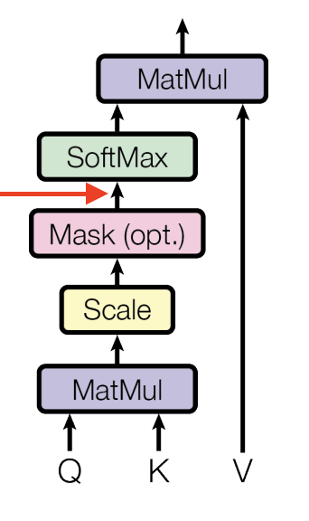
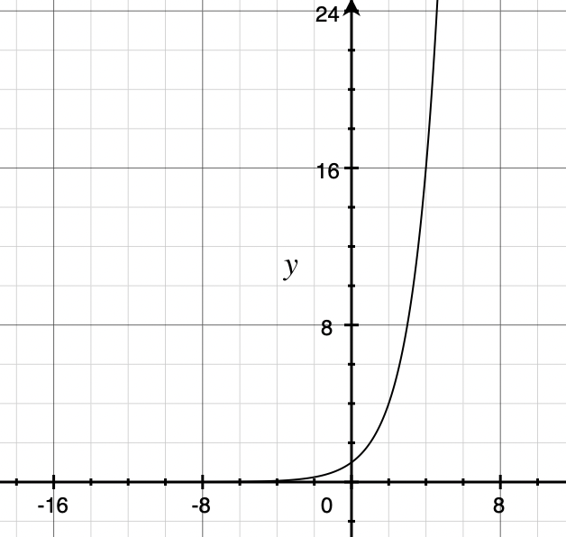

# Progress Report - 20211006 <!-- .element: class="title" -->
##  <!-- .element: class="subtitle" -->

<div class="title-name">
2021.10.06 <br>
Yu-Hung, Wu
</div>

---

## Outline

- Attention Weight Experiment
- Persona GPT-2

---

## Attention Weight Experiment  <!-- .element: class="section-title" -->

----

## Method

- Add an additional weight before softmax layer in scaled dot-product.
-  <!-- .element: class="img30" -->

----

## Method

- The weight is designed as an exponential function.
- The later the sentence appears, the greater its weight.
- 

----

## Experiments

- Without weight (weight = 1.0)

```
user:你好
chatbot:我是小妍啊！
user:我們去爬山
chatbot:我們去爬山啊！
user:還是去海邊
chatbot:我們去爬山啊！
user:不要
chatbot:我們去爬山啊！
```

- With weight (weight = 5.0)

```
user:你好
chatbot:我是小妍啊！
user:我們去爬山
chatbot:爬山是一種幸福！
user:還是去海邊
chatbot:去海邊玩啊
user:不要
chatbot:我覺得海灘很美
```

----

## Conclusion

- Add Attention does help chatbot change the topic. Moreover, it can still maintain the same topic as the user replies bland response.

- With weight (weight = 100.0)

```
user:你好
chatbot:我是小妍啊！
user:我們去爬山
chatbot:爬山是一種幸福！
user:還是去海邊
chatbot:海邊玩啊
user:不要
chatbot:我也不喜歡
```

---

## Persona GPT-2 <!-- .element: class="section-title" -->

----

