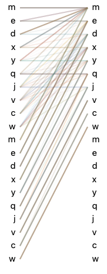

# Progress Report - 20211020 <!-- .element: class="title" -->
##  <!-- .element: class="subtitle" -->

2021.10.20  
Yu-Hung Wu @ Academia Sinica

---

## Outline

- Copy Corpus with two GPT-2s
- Chitchat Chatbot with two GPT-2s

---

## Copy Corpus with two GPT-2s  <!-- .element: class="section-title" -->

----

## Copy Corpus

- Each training/testing query contains 10 random, lowercase alphabets.
- There are 3 different amount of training set: 1000, 2000, 3000.
- For the testing set, there conatains 1000 queries.

----

## Copy Corpus

- Left GPT-2 and right GPT-2 both feeds training queries during training.
- During inference:
  - Left GPT-2: training queries
  - Right GPT-2: zero vectors

----

## Results

| len(training data) | Two GPT-2s Accuracy | Single GPT-2 Accuracy |
| :----------------: | ------------------- | --------------------- |
|        1000        | 87.87%              | 99.98%                |
|        2000        | 99.82%              | 100%                  |
|        3000        | 99.99%              | 99.99%                |

----

## Results

 <!-- .element: class="img25" -->

---

## Chitchat Chatbot with two GPT-2s <!-- .element: class="section-title" -->

----

## Method

- The left GPT-2 feeds dialogue history, the right GPT-2 feeds the response.

- For the left GPT-2, the attention masks are eliminated.

- The transformers are not initialized.

----

## In progress...

- Both baseline and tower models are still training.

- The cross-entropy loss converges really fast.