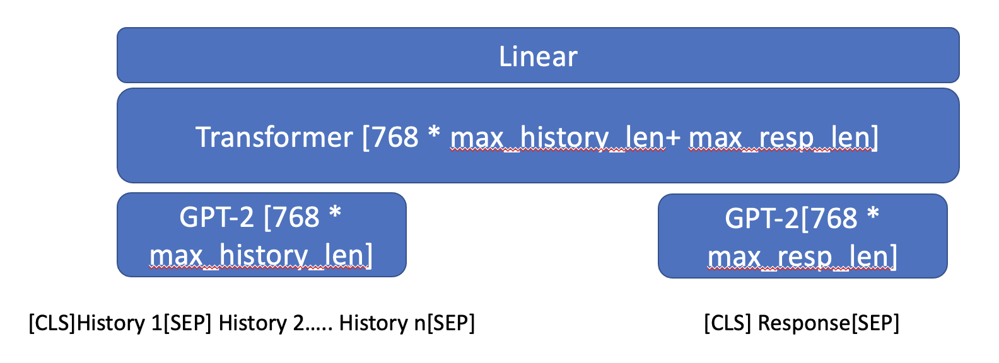
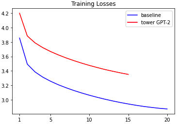
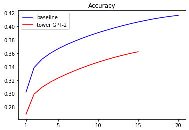
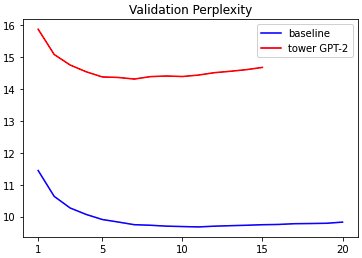
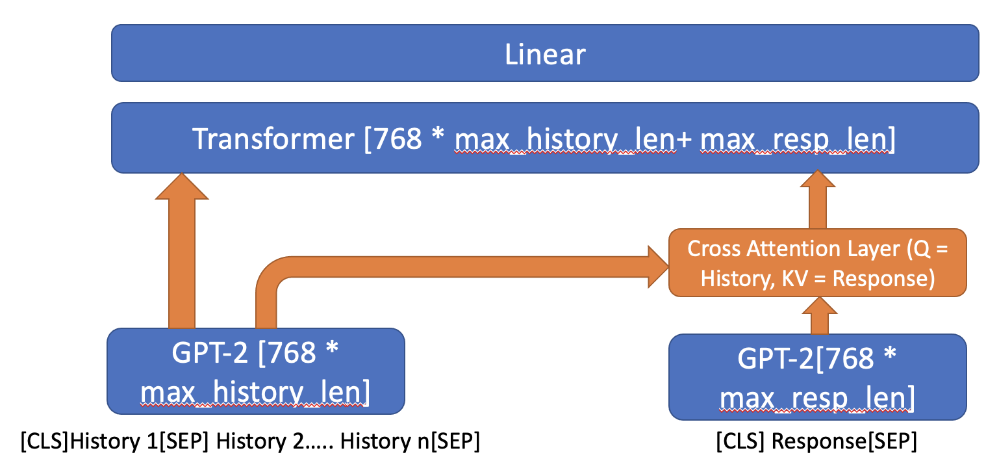
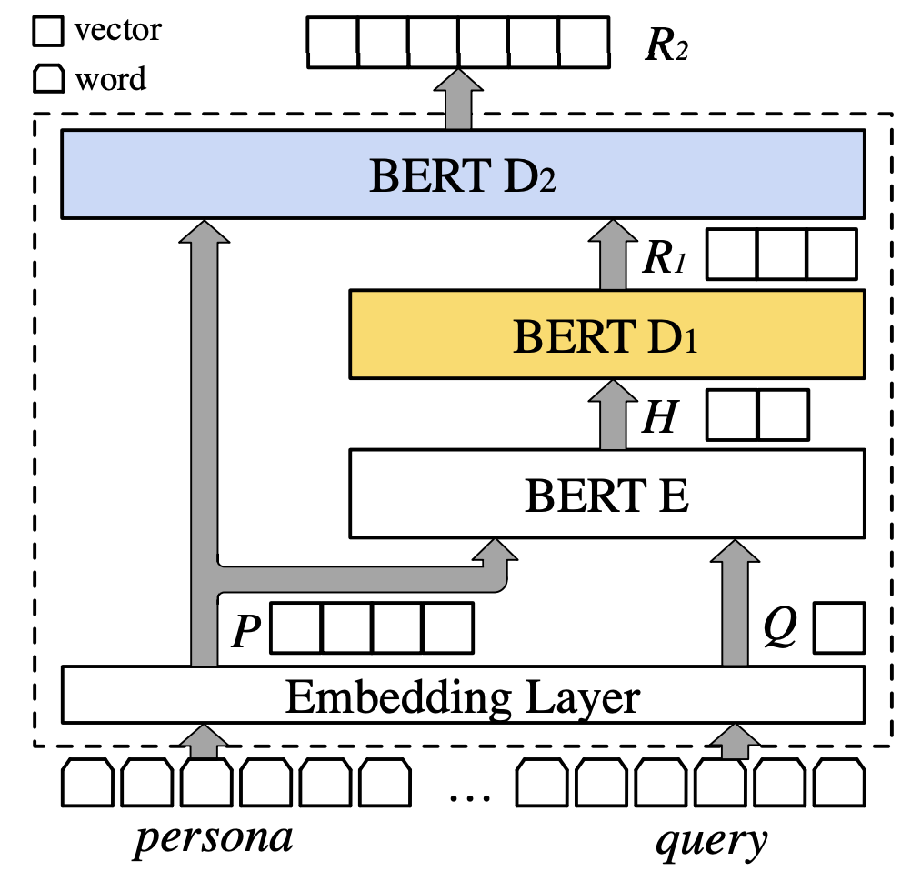
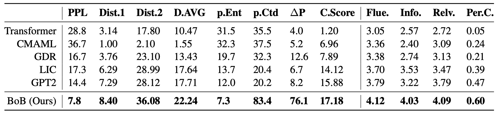

# Progress Report - 20211103 <!-- .element: class="title" -->
##  <!-- .element: class="subtitle" -->

2021.11.03  
Yu-Hung Wu @ Academia Sinica

---

## Outline

- Tower GPT-2s Experiment Results
- Proposed Model
---

## Tower GPT-2s Experiment Results  <!-- .element: class="section-title" -->

----

## Model

 <!-- .element: class="img100" -->

----

## Training

- Calculate the loss of both history and response

- The roof (3-layer transformers) is not initialized

- The histories concat directly to the response

----

## Training Loss

 <!-- .element: class="img80" -->

----

## Training Accuracy

 <!-- .element: class="img80" -->

----

## Validation Perplexity

 <!-- .element: class="img80" -->

---

## Proposed Model (Under Experiment) <!-- .element: class="section-title" -->

----

## Model

 <!-- .element: class="img100" -->

----

## PERSONA-CHAT Dataset Baseline <!-- .element: class="section-title" -->

----

## BERT over BERT (ACL 2021)

----

## Experiments

 <!-- .element: class="img100" -->