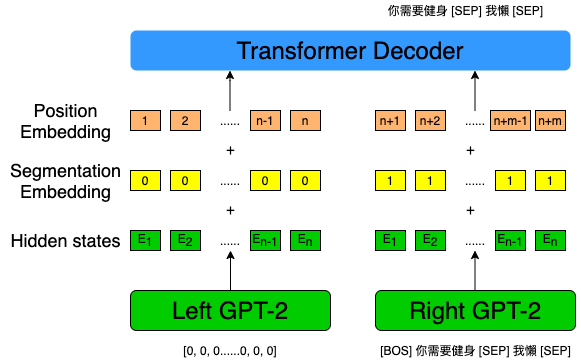
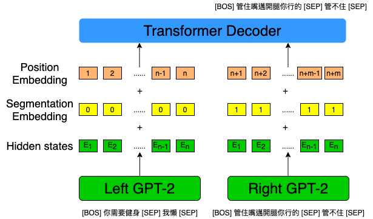
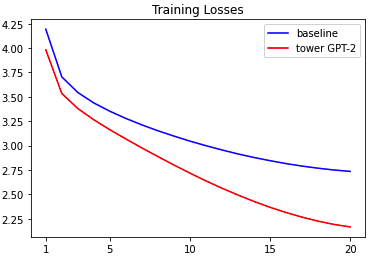
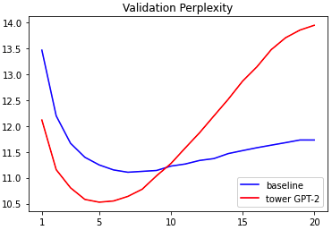
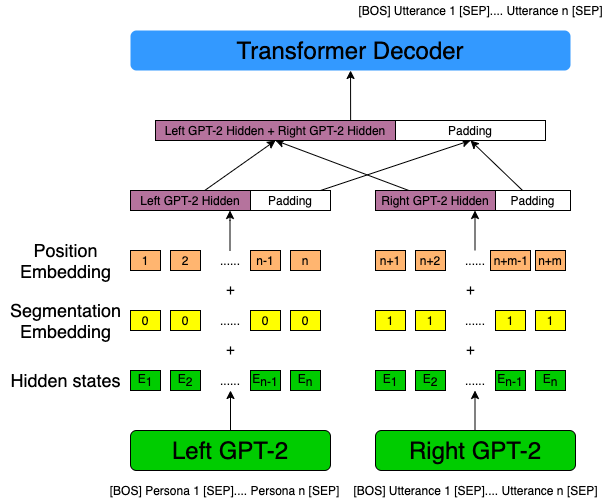

# Progress Report - 20211117 <!-- .element: class="title" -->

2021.11.17  
Yu-Hung Wu @ Academia Sinica

---

## Outline

- Tower GPT-2 Investigation
- Persona Tower GPT-2

---

## Tower GPT-2 Investigation  <!-- .element: class="section-title" -->

----

## Task

- Cut a dialogue in half. We denote the first half as $D_{1}$, and denote the second half as $D_{2}$

- Calculate 2 losses (only for the right GPT-2) for each dialog:
    1. Input a zero vector into the left GPT-2, and input $D_{1}$ into the right GPT-2
    2. Input $D_{1}$ into the left GPT-2, and input $D_{2}$ into the right GPT-2

- Add the 2 losses and compare with the baseline

----

## Task

- Sample dialog

  -   A: 你需要健身
  -   B: 我懶
  -   A: 管住嘴邁開腿你行的
  -   B: 管不住

----

## Task

- Phase 1

 <!-- .element: class="img85" -->

----

## Task

- Phase 2

 <!-- .element: class="img85" -->

----

## Experiment Configs

- Dataset
  - Training: 100,000 dialogs
  - Validation: 10,000 dialogs

- Epochs: 20

- The roof (3-layer transformers) has 2048 positions.

- The roof  is not initialized.

----

## Experiments

- Training loss

 <!-- .element: class="img75" -->

----

## Experiments

- Validation perplexity

 <!-- .element: class="img75" -->

---

## Persona Tower GPT-2 <!-- .element: class="section-title" -->

----

## Persona GPT-2

 <!-- .element: class="img75" -->

----

## Persona GPT-2

- Training the tower GPT-2 and baseline simultaneously

- Todo:
  - Iitialize the roof with the last 3 layers of GPT-2.
  - Modify the learning rate of the roof.