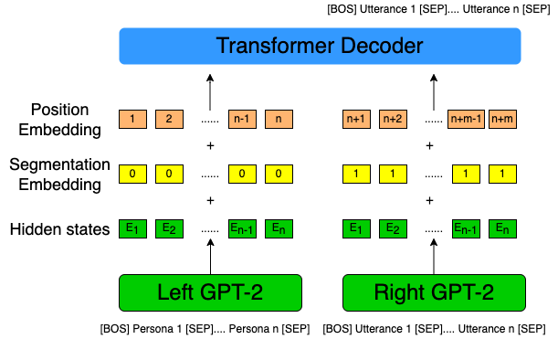
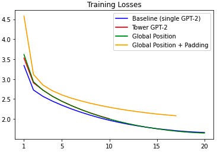
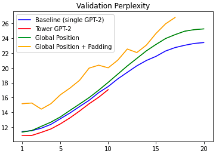

# Progress Report - 20211201 <!-- .element: class="title" -->
## Tower GPT-2 + Persona Experiment Results<!-- .element: class="subtitle" -->

2021.12.01  
Yu-Hung Wu @ Academia Sinica

----

## Baseline: GPT-2 + Transformer

 <!-- .element: class="img85" -->

----

## Tower GPT-2: Basic

 <!-- .element: class="img85" -->

----

## Tower GPT-2: Global Position

 <!-- .element: class="img85" -->

----

## Tower GPT-2: Global Position + Initilize with last 3 GPT-2 layers

 <!-- .element: class="img70" -->

----

## Experiment Results: Training Loss

- Tower GPT-2 + global position model has the lowest training loss

 <!-- .element: class="img70" -->

----

## Experiment Results: Validation Perplexity

- Basic tower GPT-2 model has the lowest perplexity

 <!-- .element: class="img70" -->