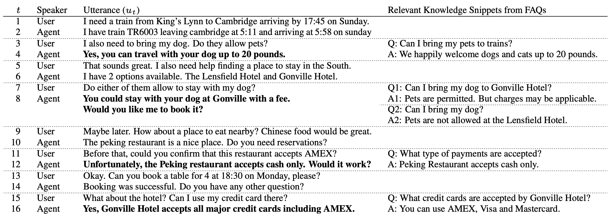
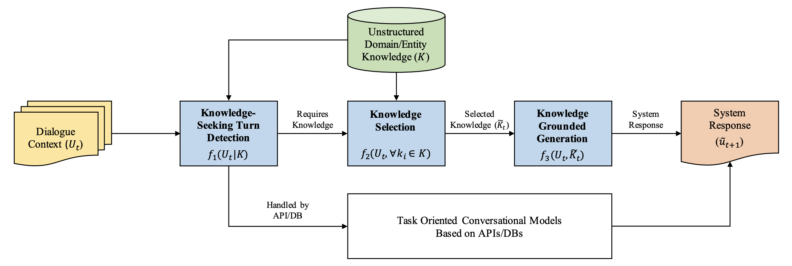

# Progress Report - 20211215 <!-- .element: class="title" -->
##  <!-- .element: class="subtitle" -->

<div class="title-name">
2021.12.15 <br>
Yu-Hung Wu @ Academia Sinica
</div>

---

## Outline

- DSTC 9 Track 1
- DSTC 7 Track 2
- Code Refactor - using Huggingface Trainer / Accelerator (cooperate w/ Albert/凱博)

---

## DSTC 9 Track 1  <!-- .element: class="section-title" -->

----

## Task

- In task-oriented dialogs, users also have needs that go beyond what is provided by the backend resources (potential follow-up questions).

- relevant domain knowledge is already available on web pages in the form of descriptions, FAQs and customer reviews...etc.

- the flow of the conversation does not break when users have requests that are out of the coverage of APIs/DB but potentially are already available in external knowledge sources.

----

## Example

 <!-- .element: class="img100" -->

----

## Baseline Model

 <!-- .element: class="img100" -->

----

## Dataset: Augmented MultiWoz 2.1

- Original MultiWoz 2.1: 7 distinct task-oriented domains including hotel, taxi, and restaurant booking...

- Augmented MultiWoz 2.1 = Original MultiWoz 2.1 + out-of-API-coverage turns grounded on external knowledge sources.

- Labels of each task are provided.

| Split | Dialogues | Utterances |
| ----- | --------- | ---------- |
| Train | 8,438     | 127,894    |
| Valid | 1,000     | 16,594     |
| Test  | 1,000     | 16,704     |

----

## Dataset: Augmented Dataset 2.1 - External Knowledge

```json
{
      "name": "A AND B GUEST HOUSE",
      "docs": {
        "0": {
          "title": "Are children welcomed at this location?",
          "body": "Yes, you can stay with children at A and B Guest House."
        },
        "1": {
          "title": "Can I bring my pet to A and B Guest House?",
          "body": "No, pets are not allowed at this property."
        },
        "2": {
          "title": "Do you have onsite parking for your guests?",
          "body": "There is onsite parking at A and B Guest House but it costs extra."
        },
        "3": {
          "title": "What time is check-in there?",
          "body": "Check-in time is from 3:30pm - 9:00pm."
        },
        "4": {
          "title": "Is smoking allowed on the property?",
          "body": "There are designated smoking areas throughout"
        },
        "5": {
          "title": "What languages are spoken?",
          "body": "English, Italian, Lithuanian, Portuguese, and Russian are spoken here."
        },
        "6": {
          "title": "Should I make a reservation for parking?",
          "body": "You need to make a reservation at A and B Guest House for parking."
        },
        "7": {
          "title": "Are children allowed to check in here?",
          "body": "An individual has to be 18 and over to check in at A and B Guest House."
        },
        "8": {
          "title": "what time do I check out?",
          "body": "Check out times range from 7:30 AM to 10:00 AM."
        },
        "9": {
          "title": "Can my small dog stay with me?",
          "body": "Pets are not allowed at the A and B Guest House."
        },
        "10": {
          "title": "What type of credit cards do you take at your location?",
          "body": "We accept American Express, Mastercard, Visa, Maestro, and Sold."
        },
        "11": {
          "title": "Is there wifi available?",
          "body": "There is free wifi available."
        },
        "12": {
          "title": "Is there a charge for parking?",
          "body": "Parking is 10 GBP per day at the A and B Guest House."
        },
        "13": {
          "title": "How much is the wifi?",
          "body": "A and B guest house has free wifi."
        },
        "14": {
          "title": "Is there housekeeping services?",
          "body": "There is housekeeping every day at A and B Guest House."
        },
        "15": {
          "title": "Is there parking available?",
          "body": "A and B Guest House does have parking."
        },
        "16": {
          "title": "Can we have extra beds put into the room?",
          "body": "A and B Guest House has extra beds or cots at availability."
        },
        "17": {
          "title": "Do this property have a meeting or banquet facility?",
          "body": "There is no meeting room or banquet hall"
        },
        "18": {
          "title": "Is there free breakfast at A and B Guest House?",
          "body": "The A and B Guest House does not provide breakfast for free."
        },
        "19": {
          "title": "What is on the breakfast menu?",
          "body": "Both continental and full English/Irish breakfast are available."
        },
        "20": {
          "title": "Is smoking allowed anywhere in the property?",
          "body": "There is a place where smokers can smoke at A and B Guest House."
        },
        "21": {
          "title": "Are the rooms at A and B Guest House accessible to those with disabilities?",
          "body": "The rooms at A and B Guest House are not accessible."
        },
        "22": {
          "title": "Does A and B Guest House offer accessible parking?",
          "body": "No, A and B Guest House does not have accessible parking."
        },
        "23": {
          "title": "Does this site offer concierge service?",
          "body": "A and B Guest House does not provide concierge service."
        },
        "24": {
          "title": "Is there a fitness center or gym available?",
          "body": "A and B Guest House does not offer a fitness center or gym."
        },
        "25": {
          "title": "Do you have any cooking facility available in the guest house?",
          "body": "Microwaves are available to use in the kitchen for guests at A AND B GUEST HOUSE."
        },
        "26": {
          "title": "Is there laundry available at the A and B Guest House?",
          "body": "Laundry is available at the A and B Guest House."
        },
        "27": {
          "title": "Does the A and B Guest House offer lift?",
          "body": "A and B Guest House doesn't offer lift."
        },
        "28": {
          "title": "Does A and B Guest House have luggage storage service.",
          "body": "Luggage and storage service is not provided here."
        },
        "29": {
          "title": "Does this site have swimming pool?",
          "body": "The A and B Guest House does not have a swimming pool."
        },
        "30": {
          "title": "Is there a restaurant onsite?",
          "body": "There is not any restaurant or bar onsite at A and B Guest House."
        },
        "31": {
          "title": "Are there safety deposit boxes in the rooms at A and B Guest House?",
          "body": "A AND B GUEST HOUSE does not have safety deposit box at the rooms."
        },
        "32": {
          "title": "Are there any spa?",
          "body": "No spa is onsite here."
        },
        "33": {
          "title": "What is the cost of security deposit?",
          "body": "A security deposit of GBP 50 per night is required at A AND B GUEST HOUSE."
        },
        "34": {
          "title": "how late can we check in?",
          "body": "The front desk is not open 24 hours at A and B Guest House."
        },
        "35": {
          "title": "Will there be a dry cleaning service offered at A And B Guest House?",
          "body": "There is no dry cleaning service offered by A AND B GUEST HOUSE."
        },
        "36": {
          "title": "Does the A and B Guest House provide room service?",
          "body": "This place does not provide room service."
        },
        "37": {
          "title": "Does this site offer any airport shuttle service?",
          "body": "Shuttle service is not provided here."
        }
      }
}
```

---

## DSTC 7 Track 2 <!-- .element: class="section-title" -->

----

## Task

- The model should have the ability to access to external knowledge in order to produce system responses that are both substantive and “useful”.

- Each system input is consisted of two parts:
  - Conversational input: The user input and $K$ most recent turns.
  - Contextually-relevant "facts": The text that are relevant to the context of the conversation. The facts are extracted from external knowledge sources (e.g. web pages).

----

## Data

- Reddit conversational data (about 3M).

- Each conversation is typically initiated with a URL to a web page, the web page forms the external knowledge.

- The dataset URL responses 404.

----

## Restaurant Data

- Tips: The "FourSquare" dataset

```
11729	404	Always go to the grill and order the seafood bouquet!
45719	404	Love this for a BIG steak when in NYC
114319	404	Go to the grill when flying solo and ask for Pat !
198603	404	Go to Whiskey Blue after. Great spot on the W on 49th & Lex
429	408	The Porterhouse
90894	408	Get the hot fudge sundae in the unlikely event you saved room for dessert.
59283	408	Single malts, the best steaks... I mean what else you can possibly ask for...
212	408	Try the New York Steak And Lobster - In the 1% tonight!  (via @Foodspotting)
152611	408	Filet mignon with Keith's sugggestion: spicey english mustard. I was skeptical. Its damn good
2022	410	Try the Choriqueso (via @Foodspotting)
22617	410	They have a new sun roof on top floor. Nice!
82720	415	Make sure you allow a lot of time between your reservation and your next activity... it's a lot more than just a restaurant, but the wait is worth it!
98821	415	wow! not going here again. theme is fun , decor is cool..but the service sucks!! waited for almost an hour for our food which was mediocre at best..and waaaayyyy over priced!!
72658	415	Visit enchanting \
56771	415	Left because service is horrible....don't waste your time.
1319	417	They got no Mexicans and no radio. I call bullshit.
7224	417	Black cherry frozen margarita!
39408	417	Best carnitas in the city hands down
29123	417	Jersey (I spelled that wrong) is the best! Kick-ass quesadillas, fajitas, guacamole, and salsa! Do the Short Wave Margarita!
55222	417	Get the chimichanga. Get it with plantains. Get into delicious vegetarian.
159682	419	Jane is loyal to their local customers! Amazing food...
56276	419	French Toast sets the bar sky high... as does their Lobster Benedict
49805	419	Devour the strawberry butter with no abandon!
159682	419	Pop singer Official Hanks old stomping ground.  http:\/\/www.iTunes.com\/officialhank
141794	419	Brunch on Sundays even with reservations r still crowded. Wait until 2pm or so when it's calmer
27297	419	The french toast is heaven. Nearly bread pudding!
60486	419	The Gnocchi is an orgasm for the mouth.. Make that multiple!!
15193	419	French toast in cr�me br�l�e batter is fantastic!
65107	422	Get a Dark 'n Stormy (or two) to cap off a Good Night.
12382	422	Try the Dirty Gin Martini - Stirred, Not Shaken - They know how to do it right here... (via @Foodspotting)
97744	422	The omelettes are awesome
713	423	Eric Friedman has not been going here longer than me
122027	423	the best cheesburger isnt here but Five Guys. Really! Here potatos miss salt, and service is normal.
9	423	Burgers are decent, but not the best ever. A little over-rates I think!
62734	423	JG Melon for nightcap with burger and jukebox
68798	423	Best burgers on the Upper East Side. Whenever I go here, I always run into someone I know from prep school or who went to Buckley or Hewitt. Small world :)
66541	423	Arguably the best hamburger in Upper East Side. Some would say in the city.
15741	423	Awesome burgers and bar! Ask for Faisal at bar, he was a fantastic bartender.
56184	423	GREAT burger, get it with bacon, no lettuce or tomato. Worth the price. Cottage fries are good too.
193062	423	A pretty decent burger here.
190646	423	Best burger in NYC - no question! Have two
8756	423	There may be better burgers in NYC, but Melon's burger is classic and amazing.  You will not be disappointed.
58220	424	The Lo-Carb burrito was great ! (3 of 4 petals via Fondu)
53930	434	The egg on a roll here is the best in the city.
53930	434	They make the best egg on a roll in the city.
67149	442	You can make a post-theater reservation by name of show if you don't know the exact time you'll get there.
58	446	I know you want a lobster roll, but that's the wrong move here. At Mary's you want to go for a whole fish. Ask your server which one, they'll know what's best today.
11372	446	Best lobster roll in NYC. Whole bronzini is the 2nd best dish. Sundae's are amazing too.
22056	446	Sardine special was great. Lobster roll too. Deep fried oysters and clams were only OK. Sliders were fine, not overwhelmingly great, but not bad.
62068	446	Lovely brunch gazpacho!
107530	446	I'd vote for the fish taco's as well. The lobster roll is very good, but too mayonnaisey for my wife.  And the lobster knuckles are fun and tasty if you are skilled at removal.
11372	446	HarryH is right, best lobster roll in the city but the star is the whole grilled daily fish. I prefer the bronzini!
54073	446	MFC is a weekly staple. Grilled whole fish, fish tacos, cockles, lobster knuckles...all good!
215619	446	lobster roll is good, for the price my vote is for luke's in e vill.. fish is worth your time & $$
12991	446	The salmon is amazing!
72	447	French her at Cafe Lalo (what?! i'm talking about the dessert!). probably after dinner at some place in the hood like Good Enough to Eat
13095	447	Rosemary olive oil at the tables - fantastic
209173	447	Cakes here are great. And so this there food. You have to come and try it
76559	447	try the... well just try everything.  Enhance it with a cappuccino an a shot of grand marnier.  YUM!
49343	447	Delicious Lemon Meringue Tart
36514	448	Make reservations!
135368	449	Amazing amazing amazing at all hrs of the day!
26055	449	I want to say coming here for breakfast is a good idea, but it just really isn't
45830	449	Try the food.
57576	449	Black and blue. Period.
43783	449	they took my plate before i was finished :(
29020	449	still havent figured out what i like to order here
```

- Conversations: from Twitter, but not found

---

## Code Refactor - using Huggingface Trainer / Accelerator (cooperate w/ Albert/凱博) <!-- .element: class="section-title" -->

----

## Motivation

- Encapsulate the model into a new class, 
- Improve the readability and the reusability of our code.
- Make distributed data parallel (DDP) easier and more reusable.

----

## Example
```python
from transformers import Trainer
# To fine-tune a Huggingface model
training_args = TrainingArguments("test_trainer")
trainer = Trainer(
    model=model, 
    args=training_args, 
    train_dataset=small_train_dataset,
    eval_dataset=small_eval_dataset
)

trainer.train()
# to evaluate a model
trainer.evaluate()
```

----

## Problems

- Two-stage training seems cannot be directly applied to the trainer.

- Data parallelism needs additional settings (interact with PyTorch).