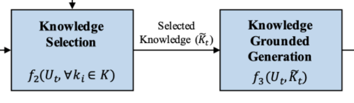
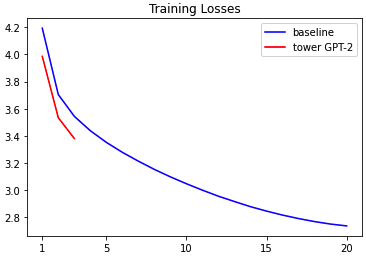
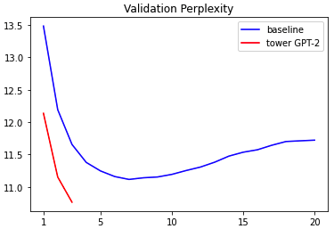

# Progress Report - 20211229 <!-- .element: class="title" -->

<div class="title-name">
2021.12.29 <br>
Yu-Hung Wu @ Academia Sinica
</div>

---

## Outline

- DSTC9 Baseline
- Reproduce 

---

## DSTC9 Track1 Baseline  <!-- .element: class="section-title" -->

----

## Baseline

 <!-- .element: class="img100" -->

----

## Baseline Results

```json
{
  "detection": {
    "prec": 0.9988540870893812,
    "rec": 0.9783015338570894,
    "f1": 0.9884709884709886
  },
  "selection": {
    "mrr@5": 0.8156366156366145,
    "r@1": 0.7212247212247214,
    "r@5": 0.943110943110943
  },
  "generation": {
    "bleu-1": 0.3619689376941501,
    "bleu-2": 0.22066123492603837,
    "bleu-3": 0.13626575992587645,
    "bleu-4": 0.09243940137516801,
    "meteor": 0.0022680022680022687,
    "rouge_1": 0.4061197759681313,
    "rouge_2": 0.174508603525566,
    "rouge_l": 0.34970513681161436
  }
}
```

----

## To-Do (in DSTC-9)

- Combine KS and KG into a single model:
    

- Specify the domain first, then use all sub-docs as knowledge.

---

## Reproduce 20211117 Progress Report

 <!-- .element: class="img90" -->

----

## Reproduce 20211117 Progress Report

 <!-- .element: class="img90" -->
