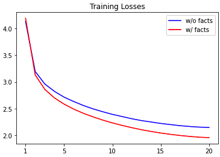
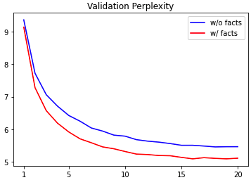

# Progress Report - 20220126 <!-- .element: class="title" -->
## Experiment on DSTC7-track2 Dataset  <!-- .element: class="subtitle" -->

2022.01.26  
Yu-Hung Wu @ Academia Sinica

---

## Dataset

- Reddit data from 2011-01 to 2011-12 (context and response)

- Each conversation will map to a fact (wiki, news page...etc.)

- For each fact (html pages), just retrieve the texts inside 
 tags

----

## Facts - Before Preprocessing

- Average length: 3,810
- Standard deviation: 5,929
- Median: 1,437

| Length Range | Document Count |
| ------------ | -------------- |
| 0 ~ 999      | 4,240          |
| 1000 ~ 1999  | 5,077          |
| 2000 ~ 2999  | 1,080          |
| 3000 ~ 3999  | 589            |
| 4000 ~ 4999  | 493            |
| 5000 ~ 5999  | 440            |
| 6000 ~ 6999  | 323            |
| 7000 ~ 7999  | 269            |
| 8000 ~ 8999  | 231            |
| 9000 ~ 9999  | 191            |
| 10000+       | 1,555          |

----

## Facts - After Preprocessing

- Average length: 2,072
- Standard deviation: 3,257
- Median: 952

| Length Range | Document Count | Diff   |
| ------------ | -------------- | ------ |
| 0 ~ 999      | 7,365          | +3,125 |
| 1000 ~ 1999  | 3,225          | -1,852 |
| 2000 ~ 2999  | 1,045          | -35    |
| 3000 ~ 3999  | 627            | +38    |
| 4000 ~ 4999  | 433            | -60    |
| 5000 ~ 5999  | 323            | -117   |
| 6000 ~ 6999  | 258            | -65    |
| 7000 ~ 7999  | 195            | -74    |
| 8000 ~ 8999  | 162            | -69    |
| 9000 ~ 9999  | 127            | -64    |
| 10000+       | 728            | -827   |

----

## Conversation

- The input of the right GPT-2 is combined with history and response, and each input will not exceed 1024 tokens:
  - [SEP] history 1 [SEP] history 2.....[SEP] history n [SEP] response

- Special tokens and brackets are ignored.

----

## Dataset Size

- Original TRIAL data: 608,701 conversations, 14,488 facts

- Dataset for experiment: 80,000 conversations for training, 20,000 conversations for validation, 20,000 conversations for testing

----

## Experiment

- GPT-2 without facts: Use single GPT-2 to predict the response (without knowledge)

- GPT-2 with facts: Tower GPT-2, where the left input is the knowledge and the right input is conversations

- For facts more than 1,024, just truncate them at length 1,024

----

## Experiment - Training Loss

 <!-- .element: class="img75" -->

----

## Experiment - Validation PPL

 <!-- .element: class="img75" -->

----

## On-progress

- Evaluation Metrics

- Evaluate tower-model on TWCC

----

## Appendix - Response Generation Example

- Response A: i'm in the red shirt.
- Ground truth A: if you look at my wrists , you can see i have a red long-sleeve shirt on under the costume . :)

- Response B: i think it was a bit of a surprise to see him get dragged away from the picture.
- Ground truth B: have you got a link to video of that ?

- Response C: [ this guy ] ( http://www.youtube.com/watch?v=yXuYXWZpzcY ) is a russian citizen. he's also a pretty bad actor.
- Ground truth C: found it . http://www.youtube.com/watch?v=RcC65zuhLPM

----

## Appendix - Response Generation Example

- Response D : i think it's funny that the bbc is so obsessed with the idea of a " rip-off " that they are willing to put up with the idea of a " free trade " agreement.

- Ground truth D: considering that complaints about " rip off britain " have been around for decades , what was he doing when in the last government to clamp down on this problem ?