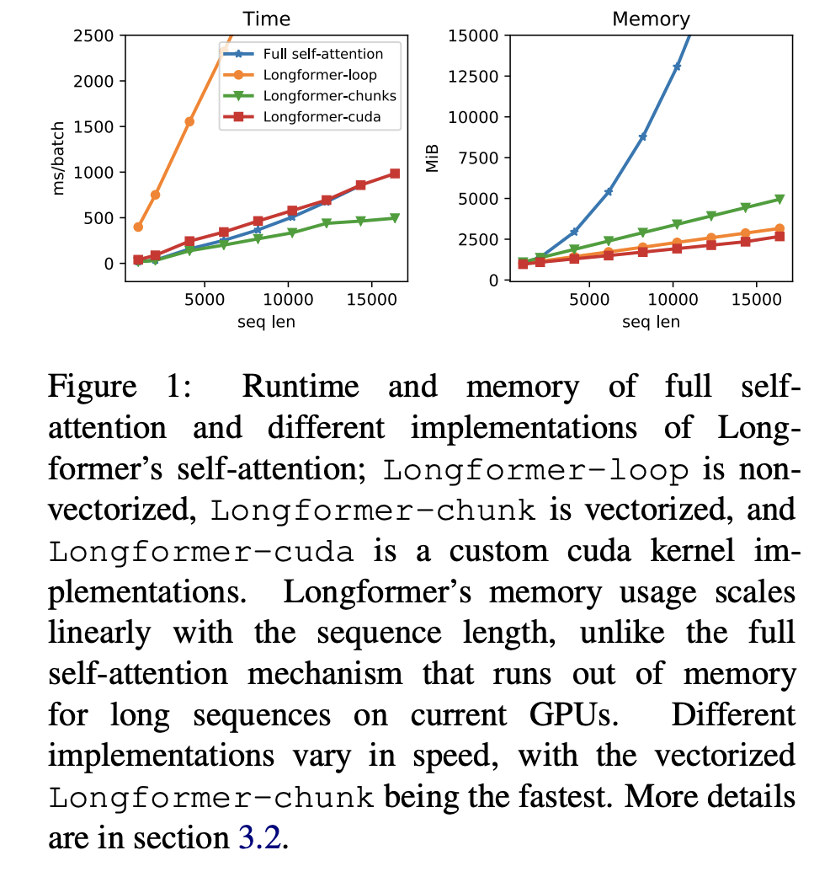

# Progress Report - 20220302 <!-- .element: class="title" -->

2022.03.02  
Yu-Hung Wu @ Academia Sinica

---

## Outline

- TriviaQA Experiement (Baseline)
- Implementation Problems

---

## TriviaQA Experiement (Baseline)  <!-- .element: class="section-title" -->

----

## TriviaQA

- TriviaQA has more than 100K question, answer, document triplets for training. 

- Documents are Wikipedia articles, and answers are named entities mentioned in the article.

- The average length of the documents is 2,630, and the maximum is 5,839.

----

## TriviaQA in Longformer

- Tokenize the question and the document using RoBERTa’s tokenizer, then form the input as:
    [CLS] question [SEP] document [SEP]

- Global attention are used on ALL question tokens.

- For prediction, we add one layer that predicts the beginning and end of the answer span.

----

## Results

- Follow the paper's settings, I use "longformer-base" to fine-tune on TriviaQA dataset.

- The F1 score:
  - Window size = 256: 73.8
  - Window size = 128: 72.8
  - Paper (window size = 256): 75.2

----

## Todo

- Run the experimnet again: set the number of epoch to 5.
- Increasing window size by 128 to 256.

---

## Implementation Problems <!-- .element: class="section-title" -->

----

## Longformer-loop vs. Longformer-chunk

 <!-- .element: class="img60" -->

----

## Longformer-loop vs. Longformer-chunk..

 <!-- .element: class="img60" -->

----

## Next Step

- Layer-wised dynamic window size:
  - Existing methods can work (with a little modification)
  - Use the [CLS] token to predict the window size

- Token-wised dynamic window size:
  - Exisiting methods cannot work in this case
    - Normal loop method is unusably slow
    - After Matrixing, the memory usage will close to full-attention, and the time complexity will exceeds full-attention

