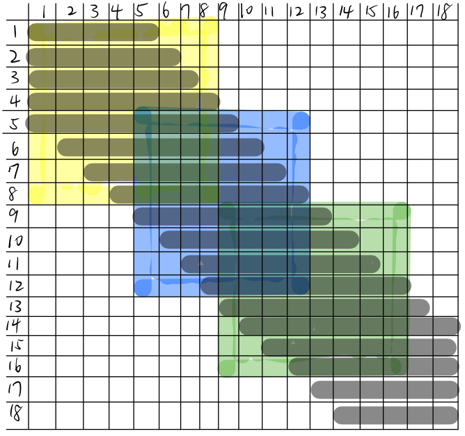
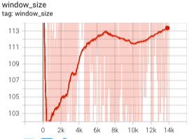

# Progress Report - 20220316 <!-- .element: class="title" -->
##  <!-- .element: class="subtitle" -->

2022.03.16  
Yu-Hung Wu @ Academia Sinica

----

## Recap

- Last week, I conducted two experiments on TriviaQA dataset:
  - One with 256 window size, resulting 73.78 on F1 score and 68.99 on EM score
  - The other with 128 window size, resulting 72.99 on F1 score and 67.72 on EM score

- I traced the code of longformer_chunk, and came up with 2 implementation problems.

----

## Recap.

- Assume that window size = 3 (each token can perform self-attention to at most 7 tokens)

 <!-- .element: class="img60" -->

----

## Recap..

- Assume that window size = 4 (each token can perform self-attention to at most 9 tokens)

 <!-- .element: class="img60" -->

----

## Recap...

- Layer-wised dynamic window size:
  - Existing methods can work (with modification)
  - Use the [CLS] token to predict the window size

- Token-wised dynamic window size:
  - Exisiting methods cannot work in this case
    - Normal loop method is unusably slow
    - After Matrixing, the memory usage will close to full-attention, and the time complexity will exceeds full-attention

----

## Layer-wised Dynamic Window Experiment

- A classification approach: using the [CLS] token of each hidden state to predict the window size.

- Given a maximum window size $w$, the range of window size in each layer is $[1,w]$.

----

## Layer-wised Dynamic Window Result

- Average window size (all): 131

- Average window size (at layer 12): 112

| Method                      | F1 Score            | Exact Match         |
| --------------------------- | ------------------- | ------------------- |
| Fixed window size (256)     | 73.78               | 68.99               |
| Fixed window size (128)     | 73.25               | 68.08               |
| **Fixed window size (112)** | 72.84               | 67.72               |
| **Dynamic window (CLS)**    | 73.48, 73.57, 73.61 | 68.38, 68.44, 68.53 |

----

## Window Size Visualization

 <!-- .element: class="img70" -->