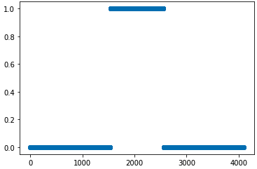

# Progress Report - 20220330 <!-- .element: class="title" -->

<div class="title-name">
2022.03.30 <br>
Yu-Hung Wu @ Academia Sinica
</div>

----

## Recap

- Last week, I modified the code of Longformer, making it applicable to dynamic attention window selection.

- The original method to predict the window size is non-differentiable.

----

## Differentiable Attention Window

- Instead of predicting the window size directly, predict the standard deviation ($\sigma$) of normal distribution.

- This solves the continuity problem of the window size, since the std is not necessarily integer.


----

## Differentiable Attention Window.

- Use the $[CLS]$ token of each hidden state to predict $\sigma$.

- Generate the PDF of normal distribution.

- Set a threshold (e.g. 0.5) and apply to the PDF.

----

## Differentiable Attention Window..

1. The hidden state of $[CLS]$ token is passed into a linear projection layer and a sigmoid function to generate the standatd deviation $\sigma$.
    - $\sigma = Sigmoid(L(E_{[CLS]}$))

2. Apply the formula for the PDF of normal distribution, and generate a normal distribution vector $V$:
    - $f(x) = \frac{1}{\sigma\sqrt{2\pi}} 
e\left( -\frac{1}{2}\left(\frac{x-\mu}{\sigma}\right)^{2}\\right)$, where $\sigma$ is the standard deviation and $\mu$ is the mean.

----

## Differentiable Attention Window...

3. Apply a threshold to the calculated normal distribution.
    - The threshold is a hyperparameter. The range of $f(x)$ is $[0,1]$, so the threshold must be in the interval $[0,1]$.
    - For each element in $V$:
      - If the value > threshold, retain its value.
      - Otherwise, set it to 1.

4. Generate an approximated attention mask:
    - $M = 1 - V^{p}$, where $p$ can be treat as a hyperparameter.

----

## Pseudo code

```python
proj_cls = linear_layer(cls_hidden_state)
std = sigmoid(proj_cls) # Get the standard deviation
range_tensor = range(L) # Generate a tensor [0,1,2,...,L-1]
normal_distribution = vectorized_nd(range_tensor, std) # apply the normal distribution
th = threshold(normal_distribution, threshold, 1)
attention_mask = 1 - pow(normal_distribution, p)
```

----

## Example

- Assume that $p$ = 10000, threshold = 0.9 (attention window size = 299)
 <!-- .element: class="img70" -->

----

## Example.

- Assume that $p$ = 10000, threshold = **0.8** (attention window size = 511)

 <!-- .element: class="img70" -->

----

## Example..

- Assume that $p$ = **100**, threshold = 0.9 (attention window size= 299)

 <!-- .element: class="img70" -->

----

## Apply to ```longformer-chunk``` (Todo)

 <!-- .element: class="img40" -->

- The resulting attention matrix is (2w $\times$ n), where w is the window size and  n is the sequence length.
- Truncate the non-zero part in $M$, and perform dot product with the attention matrix.

----

## Todo

- Apply differentiable attention window to longformer.

- Survey another way to generate the attention mask vector.
    - Sparse Sinkhorn Attention

- Figure out why the gradient vanished when $p$ is large (~10000).