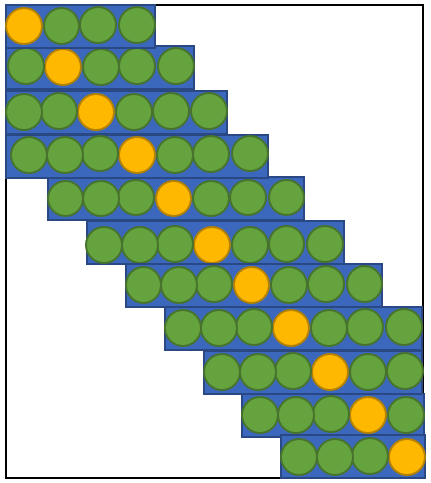
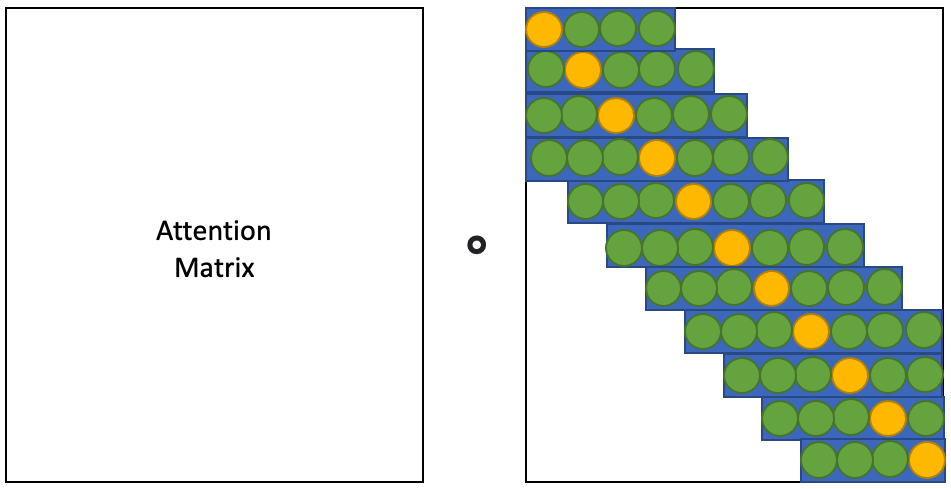

# Progress Report - 20220413 <!-- .element: class="title" -->

2022.04.13  
Yu-Hung Wu @ Academia Sinica

----

## Formula Modification
| Object                   | Original                                                           | Modified                                                                                                                            |
| ------------------------ | ------------------------------------------------------------------ | ----------------------------------------------------------------------------------------------------------------------------------- |
| Standard deviation (std) | $\sigma = Sigmoid(Linear(E_{[CLS]}))$                              | $\sigma = ReLU(Linear(E_{[CLS]}))$                                                                                                  |
| Bell curve vector        | $V = [f(0), f(1), f(2)...f(N-1)]$, where $N$ is the sequence length. | $V = [f(\frac{2\times0}{N-1} - 1), f(\frac{2\times1}{N-1} - 1),...f(\frac{2\times (N-1)}{N-1} - 1)]$, where $N$ is the sequence length. |
| Thresholding             | $V' = Threshold(V, T, 1)$                                          | $V' = Threshold(V, T, 0)$                                                                                                           |
| Smoothing                | $M = 1 - V'^{p}$, where $p$ is a hyperparameter.                   | $M = tanh(p\cdot V')$, where $p$ is a hyperparameter.                                                                               |

- Bell curve formula: $f(x) = \frac{1}{\sigma\sqrt{2\pi}} 
e\left( -\frac{1}{2}\left(\frac{x-\mu}{\sigma}\right)^{2}\\right)$, where $\sigma$ is the standard deviation and $\mu = 0$.

----

## Attention Multiplication Matrix

- Yellow dots indicate the "center" point in the vector (with the largest value).

- Green dots indicate the "non-zero" part in the vector.

 <!-- .element: class="img40" -->

----

## Attention Multiplication Matrix

- Only multiply the non-zero part in the right matrix.

<!-- .element: class="img80" -->

----

## Todo

- Continuing apply dynamic window selection to longformer.

- Survey another way to generate the attention mask vector.
    - Sparse Sinkhorn Attention