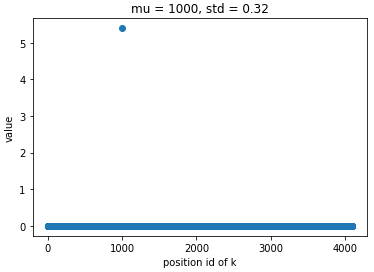
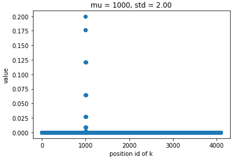
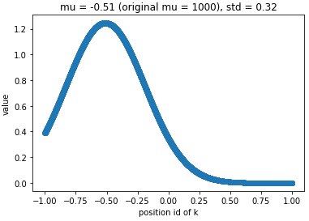
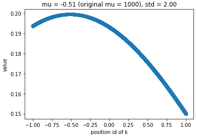

# Progress Report - 20220427 <!-- .element: class="title" -->
##  <!-- .element: class="subtitle" -->

<div class="title-name">
2022.04.27 <br>
Yu-Hung Wu @ Academia Sinica
</div>

----

## Outline

- Differentiable Attention Window
- Constraints
- Todo

----

## Differentiable Attention Window

- A two-stage training:
    1. Use a smaller scale to train a strategy of sliding window
        - Update the sliding window network and the backbone model simultaneously (without slicing the window dynamically).

    2. Update the model with a large scale using the learned strategy
        - Only update the backbone model (using the slicing window strategy to optimize the computational cost)


----

## Differentiable Attention Window

1. Use a smaller scale to train a strategy of sliding window

    - $Score(Q_{i}, K_{j}) = softmax(S_{i, j} \odot U_{i, j}$)
        - where $S_{i, j}$ is the original attention score of $Q_{i}$ and $K_{j}$, $U_{i, j}$ is a slicing-like distribution of $Q_{i}$ and $K_{j}$, $\odot$ is the element-wise (Hadamard) product.
    
    - An example of $U_{i, j}$ is a normal distribution, i.e. $U_{i, j} = \frac{1}{\sigma\sqrt{2\pi}}e^{-\frac{1}{2}\left(\frac{j-i}{\sigma}\right)^{2}\}$, where $\sigma$ is a learnable standard deviation of the normal distribution.

    - Following *Modeling Localness for Self-Attention Networks* (Yang, 2018), $\sigma = U_{d}*tanh(Q_{i}W_{p})$, where $U_{d}$ is a trainable linear projection and $W_{p}$ is a model parameter.

https://aclanthology.org/D18-1475.pdf <!-- .element: class="footnote" -->

----

## Differentiable Attention Window

2. Update the model with a large scale using the learned strategy

    - Follow the formulas in the previous slide, excepting $U_{d}$, $W_{p}$ are not learnable.

    - Perform *thresholding* to the slicing-like distribution: $U_{i, j}^{\prime} = Threshold(U_{i, j}, T)$, where $T$ is a hyperparameter.

    - Recalculate the attention score $Score(Q_{i}, K_{j}) = softmax(S_{i, j} \odot U_{i, j}^{\prime}$), but only calculate the non-zero part of the matrix.

----

## The NaN Problem

- ```inf``` times everything is still ```inf```, except for 0

```python
>>> torch.inf * torch.inf
inf
>>> torch.inf * 87
inf
>>> torch.inf * 0
nan
```

----

## Normal Distribution Scaling

-  $U_{i, j} = \frac{1}{\sigma\sqrt{2\pi}}e^{-\frac{1}{2}\left(\frac{j-i}{\sigma}\right)^{2}\}$

- If we set $i, j$ to their positional ids directly, the tensor will be a bit like pulse:

<div id="left"> 

 <!-- .element: class="img110" --> 

</div>
<div id="right"> 

 <!-- .element: class="img110" -->

 </div>
----

## Normal Distribution Scaling

- Otherwise, if we perform the scaling method, the property of normal distribution is easily observed:

    $U_{i, j} = \frac{1}{\sigma\sqrt{2\pi}}e^{-\frac{1}{2}\left(\frac{j^{\prime}-i^{\prime}}{\sigma}\right)^{2}\}$, where $[i^{\prime}, j^{\prime}] = \frac{2\times[i, j]}{N-1} - 1$

<div id="left">

 <!-- .element: class="img110" --> 

</div>
<div id="right"> 

 <!-- .element: class="img110" --> 

</div>

----

## Window Size Constraint

- We can obtain the standard deviation of all queries in a single layer:
    $\Sigma = U_{d}∗tanh(Q*W_{p})$, where $Q = [q_{0}, q_{1}, q_{2}...q_{n-1}]$

- We can set the summation of standard deviation as a constant value $C$. Thus, the constrained standard deviation is: $\Sigma^{\prime} = C * softmax(U_{d}∗tanh(Q*W_{p}))$

----

## Progress and Todos

- Progress this week

    - Stage #1 done, but not yet trained (out of memory in midnight...).

- Todos
    1. Apply window size constraint to stage 1
    2. Investigate the computational cost in stage 2