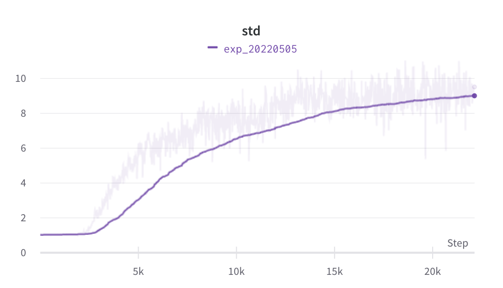
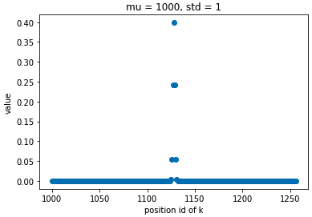
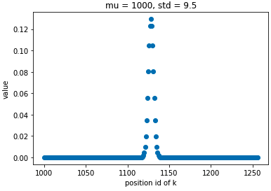
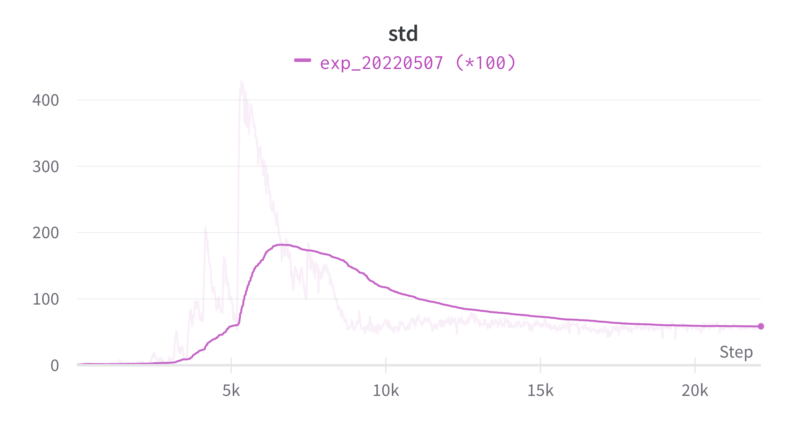

# Progress Report - 20220511 <!-- .element: class="title" -->

2022.05.11  
Yu-Hung Wu @ Academia Sinica

---

## Outline

- Previous Models
- Proposed Model
- Results & Studys
- Conclusion

---

## Stage #1 Experiment (without constraint)<!-- .element: class="section-title" -->

----

## Differentiable Attention Window

- A two-stage training:
    1. **Use a smaller scale to train a strategy of sliding window**
        - **Update the sliding window network and the backbone model simultaneously (without slicing the window dynamically).**

    2. Update the model with a large scale using the learned strategy
        - Only update the backbone model (using the slicing window strategy to optimize the computational cost)

----

## Stage #1 Setting

- Window size = 128 (each token can attends up to 257 tokens)

- Bell curve formula: $U_{i, j} = \frac{1}{\sigma\sqrt{2\pi}}e^{-\frac{1}{2}\left(\frac{j-i}{\sigma}\right)^{2}\}$, where $i$ is the query id and $j$ is the key id.

----

## Standatd Deviation Training Curve

 <!-- .element: class="img90" -->

- $\sigma$ increases from 1 to 9.5

----

## Standatd Deviation Training Curve

- When $\sigma$ = 1, each token can actually attends up to 29 tokens (w = 14)

 <!-- .element: class="img40" -->

- When $\sigma$ = 9.5, each token can attends up to 89 tokens (w = 44)

 <!-- .element: class="img40" -->

----

## Standatd Deviation Training Curve

* Times the learning rate by 10

111 (w = 55)

----

## Standatd Deviation Training Curve

* Times the learning rate by 100

 <!-- .element: class="img90" -->

----

## Training Result

| Exp Setting                       | Testing F1 Score | Testing EM Score |
| --------------------------------- | ---------------- | ---------------- |
| Normal LR                         | 57.29            | 49.13            |
| LR*10                             |                  |                  |
| LR*100                            | 58.01            | 50.02            |
| *Window size = 128 (non-dynamic)* | *73.25*          | *68.08*          |

----

