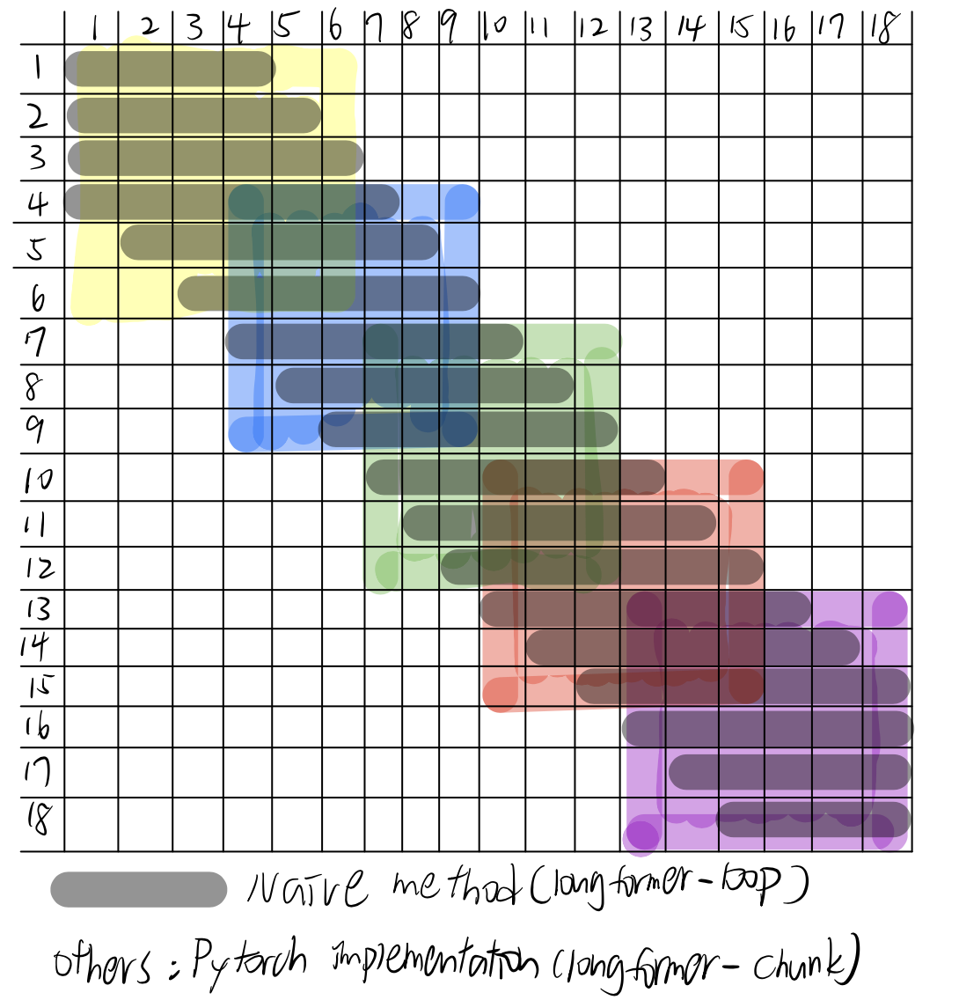

# Progress Report - 20220511 <!-- .element: class="title" -->

<div class="title-name">
2022.05.11 <br>
Yu-Hung Wu @ Academia Sinica
</div>

---

## Outline

- Stage #1 Experiment
- Stage #2 Implementation problem

---

## Stage #1 Experiment (without constraint) <!-- .element: class="section-title" -->

----

## Differentiable Attention Window

- A two-stage training:
    1. **Use a smaller scale to train a strategy of sliding window**
        - **Update the sliding window network and the backbone model simultaneously (without slicing the window dynamically).**

    2. Update the model with a large scale using the learned strategy
        - Only update the backbone model (using the slicing window strategy to optimize the computational cost)

----

## Stage #1 Setting

- Window size = 128 (each token can attends up to 257 tokens)

- Bell curve formula: $U_{i, j} = \frac{1}{\sigma\sqrt{2\pi}}e^{-\frac{1}{2}\left(\frac{j-i}{\sigma}\right)^{2}\}$, where $i$ is the query id and $j$ is the key id.

----

## Standard Deviation Training Curve

 <!-- .element: class="img90" -->

- $\sigma$ increases from 1 to 9.5

----

## Standard Deviation Training Curve

- When $\sigma$ = 1, each token can actually attends up to 29 tokens (w = 14)

 <!-- .element: class="img40" -->

- When $\sigma$ = 9.5, each token can attends up to 89 tokens (w = 44)

 <!-- .element: class="img40" -->

----

## Standard Deviation Training Curve

* Times the learning rate by 10

 <!-- .element: class="img60" -->

- $\sigma$ increases from 1 to 15 (when $\sigma$ = 15, each token can attends up to 111 tokens)

----

## Standard Deviation Training Curve

* Times the learning rate by 100

 <!-- .element: class="img90" -->

----

## Training Result

| Exp Setting                       | Testing F1 Score | Testing EM Score |
| --------------------------------- | ---------------- | ---------------- |
| Normal LR                         | 57.29            | 49.13            |
| LR*10                             | **59.42**            | **51.92**            |
| LR*100                            | 58.01            | 50.02            |
| *Window size = 128 (non-dynamic)* | *73.25*          | *68.08*          |

----

## Next Step

- Add constraint to stage #1

- Try another slicing-like distribution

---

## Stage #2 Implementation problem <!-- .element: class="section-title" -->

----

## ```Longformer``` Experiements


----

## Implementations

 <!-- .element: class="img35" -->

- Colored blocks are the **longformer-chunk** implementation, however it only applies to fixed window size.

- If we calculate the gray part separately (**longformer-loop**), it is unusably slow.

- **longformer-cuda** *may* be a possible solution for dynamic attention window.