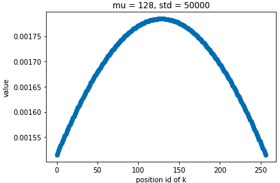

# Progress Report - 20220525 <!-- .element: class="title" -->

2022.05.25  
Yu-Hung Wu @ IIS, Academia Sinica

https://marzear.github.io/slides/pr_20220525.html <!-- .element: class="footnote" -->

---

## Results

1. Dynamic standard deviation

| Exp Setting   | Starting $\sigma$ | Ending $\sigma$ | Testing F1 Score | Testing EM Score |
| ------------- | ----------------- | --------------- | ---------------- | ---------------- |
| **Normal LR** | 1.0               | 8.0             | 59.35            | 52.03            |
| **Normal LR** | 9.5               | 17.3            | 58.30            | 51.07            |
| LR*10         | 1.0               | 15.0            | 59.42            | 51.92            |
| LR*100        | 1.0               | 58.2            | 58.01            | 50.02            |

2. Fixed standard deviation

| Exp Setting                                 | Testing F1 Score | Testing EM Score |
| ------------------------------------------- | ---------------- | ---------------- |
| **Fixed $\sigma$  ($\sigma$=1.0, w=14)**    | 56.59            | 49.23            |
| **Fixed $\sigma$  ($\sigma$=9.5, w=44)**    | 58.47            | 50.96            |
| **Fixed $\sigma$  ($\sigma$=64, w=112)**    | 58.15            | 49.69            |
| **Fixed $\sigma$  ($\sigma$=1000, w=128)**  | 53.65            | 43.89            |
| **Fixed $\sigma$  ($\sigma$=50000, w=128)** | 53.30            | 43.41            |

---

## Results

3. Fixed window size (w/o standard deviation)

| Exp Setting                 | Testing F1 Score | Testing EM Score |
| --------------------------- | ---------------- | ---------------- |
| Fixed window size (256)     | 73.78            | 68.99            |
| **Fixed window size (128)** | 73.11            | 68.00            |
| Fixed window size (112)     | 72.84            | 67.72            |
| **Fixed window size (44)**  | 72.22            | 66.91            |

---

## Observations

1. Adding normal distribution to the attention weights has negative effect to the performance.

2. Using token embeddings to predict $\sigma$s has worked.

3. Increasing the learning rate of $U_{d}$ and $W_{p}$ (both contribute to the calculation of $\sigma$) improves the performance.

4. Increasing $\sigma$ has negative effect to the performance.

---

## Problems

* *Longformer* uses global attention + sliding window method.

* Global attention tokens attend to every tokens; every token attend to global attention tokens.

---

## Problems.

* Each token calculates its attention score base on global tokens + sliding window tokens.

* Our purpose is to only accelerate the memory efficiency of "sliding window tokens"; therefore, we only apply our method to sliding window tokens.

* Since all values of normal distribution PDF curve < 1, it decreases the attention weights itself.

---

## Problems..

* If $\sigma = 50000$, the curve is very close to uniform distribution.

* However, after the global attention tokens participating in the attention weight calculation, the weights of sliding window tokens are nearly ZERO!

---

## Modification

* Original normal distribution curve: $U_{i, j} = \frac{1}{\sigma\sqrt{2\pi}}e^{-\frac{1}{2}\left(\frac{j-i}{\sigma}\right)^{2}\}$, where $\sigma$ is a learnable standard deviation of the normal distribution, $j$ is the position id of a key and $i$ is the position id of a query.

* Modified ~~normal distribution~~ bell curve: $U_{i, j} = e^{-\frac{1}{2}\left(\frac{j-i}{\sigma}\right)^{2}\}$.

* The maximum value of the bell curve is 1.