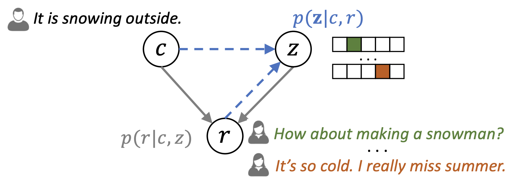
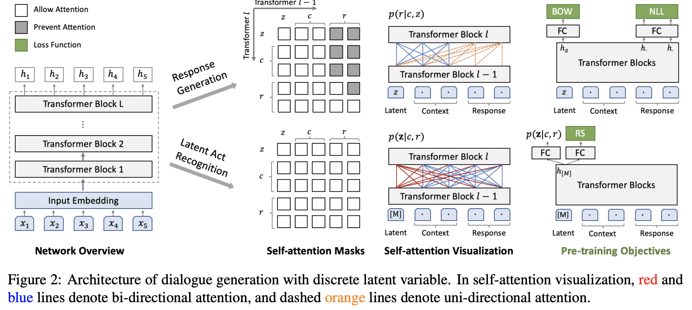
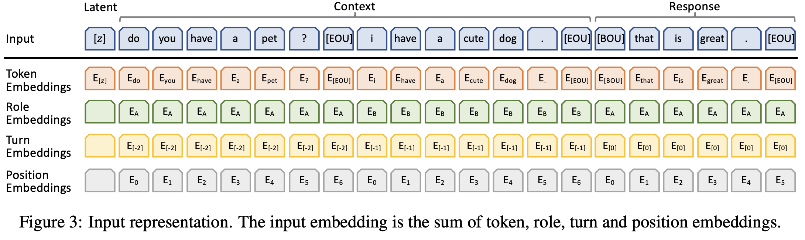
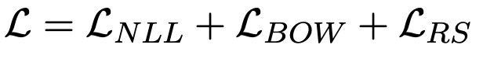
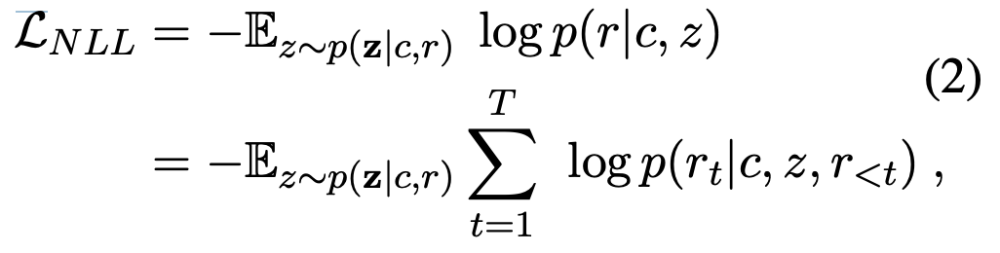
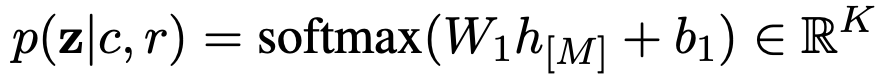

# PLATO: Pre-trained Dialogue Generation Model with Discrete Latent Variable <!-- .element: class="title" -->
## ACL 2020 <!-- .element: class="subtitle" -->

2021.12.24  
Yu-Hung Wu @ Academia Sinica

https://arxiv.org/abs/1910.07931 <!-- .element: class="footnote" -->

---

## Outline

- Introduction
- PLATO
- Experiments
- Conclusion

---

## Introduction  <!-- .element: class="section-title" -->

----

## Background

- Dialogue generation in open-domain conversations is a challenging task, due to
    1. limited corpus of human conversations.
    2. complex background knowledge.
    3. Diverse relationships between utterances.

- Pre-trained large-scale language models can be used for generation after being fine-tuned.

- However, there are some deficiencies in performance while directly fine-tuning BERT on small conversation datasets.

----

## Problems

1. The underlying linguistic patterns in human conversations can be highly different from those in general text.

2. The training mode of uni-directional dialogue generation is also distinct from that of bi-directional natural language understating as applied in BERT.

3. There exists a ***one-to-many*** relationship in dialogue generation.

----

## Solutions

1. The underlying linguistic patterns in human conversations can be highly different from those in general text.
    - Large-scale Reddit and Twitter conversations are utilized.
2. The training mode of uni-directional dialogue generation is also distinct from that of bi-directional natural language understating as applied in BERT.
    - A flexible paradigm integrating uni- and bi-directional processing is employed.
3. There exists a ***one-to-many*** relationship in dialogue generation.
    - Discrete latent variable is introduced.

----

## Latent Variable

- The latent variable gets exempted from the restriction of human annotations and can be learned automatically from the corpus.

- There are 2 tasks in this work:
    1. Response generation: Based on the context and latent variable, the generation task tries to maximize the likelihood of the target response.

    2. Latent act recognition: Based on the given context and target response, the task aims to estimate the latent variable.

---

## PLATO <!-- .element: class="section-title" -->

----

## Basic Idea

- The main purpose is to encode discrete latent variables into transformer blocks for one-to-many relationship modeling.

- In the model, there are 3 elements:
    1. dialogue context (dialogue history, knowledge...) $c$
    2. target response $r$
    3. latent variable $z$: a $K$-way categorical variable $z ∈ [1, K]$

----

## Probabilistic Relationships

- Response generation (gray lines) - Given a context $c$ and latent variable $z$, conditioned on the context and one selected latent speech act, the response $r$ is generated as $p(r|c, z)$.

- Latent act recognition (dashed blue lines): Given a pair of context $c$ and response $r$, the underlying latent speech act $z$ can be estimated as $p(z|c, r)$.

 <!-- .element: class="img95" -->

----

## Model Architecture - 1 

 <!-- .element: class="img100" -->

- The latent act recognition shares network parameters with response generation.
- The response generation is a uni-directional decoding process, each token in the response only attends to those before it.

----

## Model Architecture - 2 

 <!-- .element: class="img100" -->

- The latent act recognition works with a special mask symbol $[M]$ as input, it keeps collecting information from the context and target response.

----

## Input Representation

 <!-- .element: class="img100" -->

- Given that $z$ is one $K$-way categorical variable, its token embedding $E[z]$ is mapped from the latent embedding space $ E_{z} ∈ \mathbb{R}^{K×D} $.

----

## Pre-training Objectives

- In this task, there are 3 losses:
    1. negative log-likelihood (NLL) 
    2. bag-of-words (BOW)
    3. response selection (RS) loss

- The total objective of our pre-training model is to minimize the integrated loss:
    

----

## Negative Log-likelihood (NLL) 

 <!-- .element: class="img60" -->

- $z$ is the latent speech act of this training pair $(c, r)$, sampled from the probability distribution $p(z|c, r)$.

- $p(z|c,r)$ is estimated through the task of latent act recognition:
    
    where $h[M] ∈ \mathbb{R}^{D}$ is the final hidden state of the special mask, $W_{1} ∈ \mathbb{R}^{K×D}$ and $b_{1} ∈ \mathbb{R}^{K}$ denote
the weight matrices of one fully-connected layer.