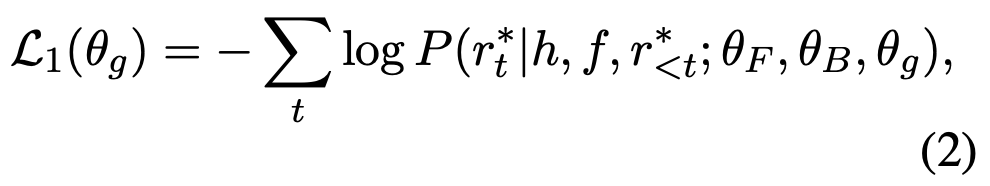
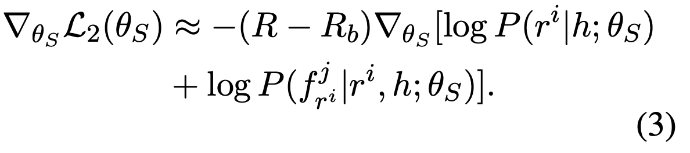
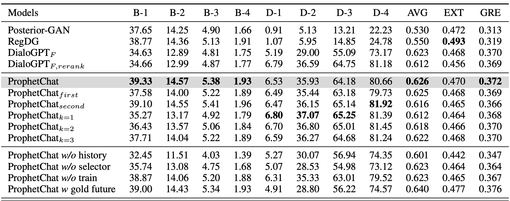
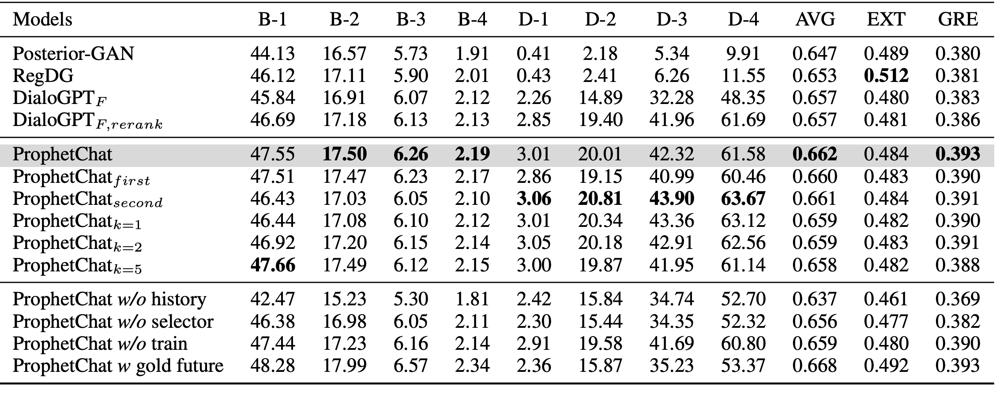
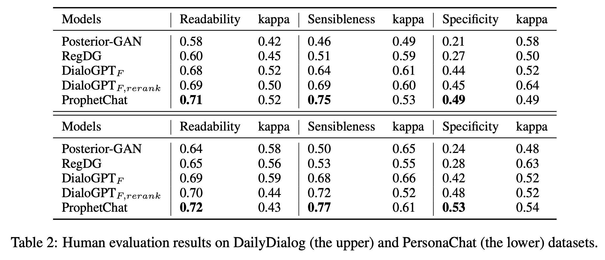
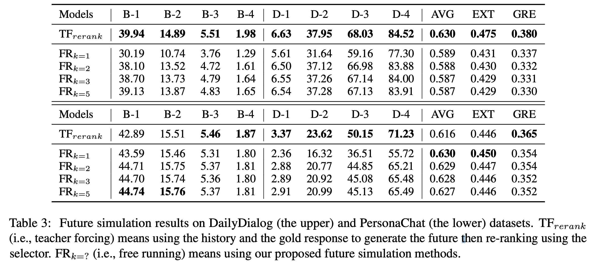
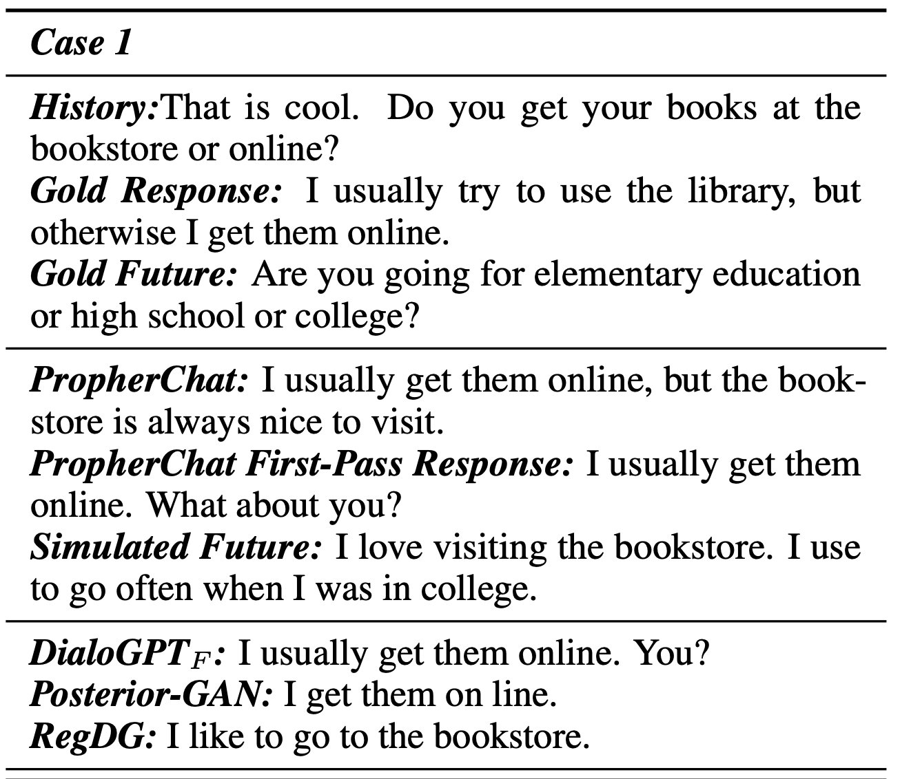
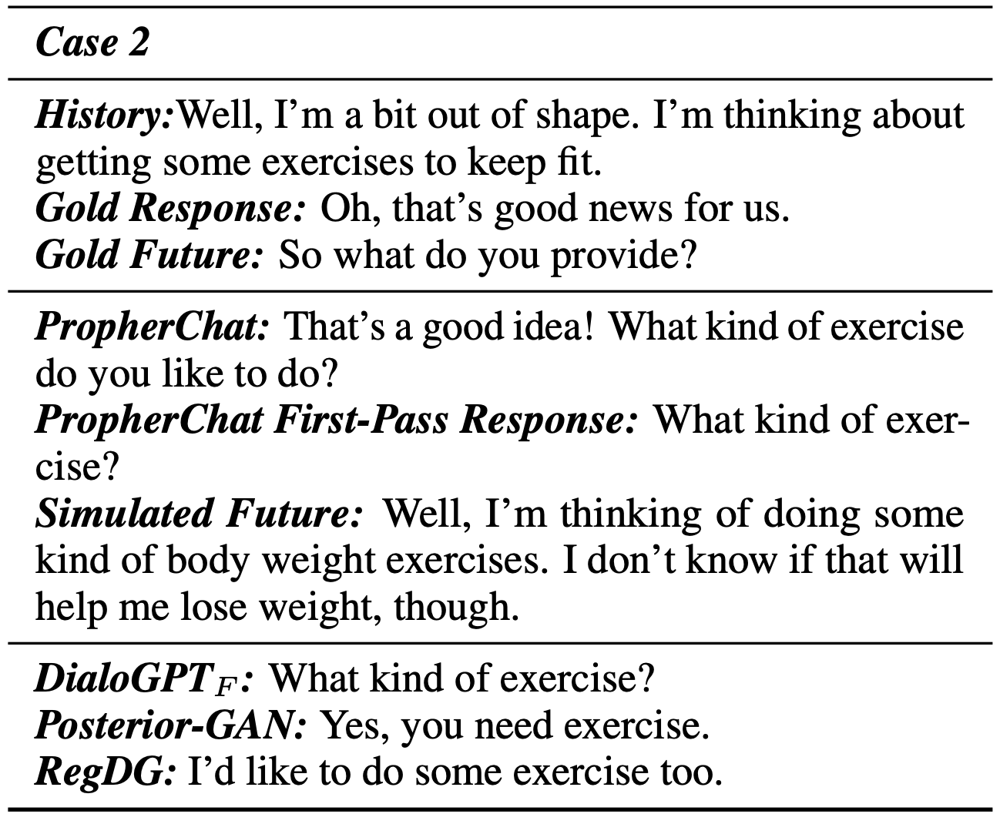

# ProphetChat: Enhancing Dialogue Generation with Simulation of Future Conversation <!-- .element: class="title" -->
## Liu et al., ACL 2022<!-- .element: class="subtitle" -->

<div class="title-name">
2022.06.10 <br>
Yu-Hung Wu @ IIS, Academia Sinica
</div>

https://aclanthology.org/2022.acl-long.68/ <!-- .element: class="footnote" -->

---

## Outline

- Previous Model
- Proposed Model
- Results & Studies
- Conclusion

---

## Previous Model  <!-- .element: class="section-title" -->

----

## Dialogue Generation in Open-domain Conversations

- Recent dialogue systems usually utilize the dialogue history to generate the response, i.e. estimate the probability of $P(response|history)$.

- There are some common problems in such systems:

    1. Generating bland responses (e.g., yeah, ha ha) is the most critical problem.

    2. It also poses a greater **one-to-many** problem than is typical in other text generation tasks.

    3. The underlying linguistic patterns in human conversations can be highly different from those in general text.

----

## DialoGPT (Zhang et al., 2020)

- DialoGPT is formulated as an autoregressive language model, and uses the multi-layer transformer as model architecture.

- The model is trained on large-scale dialogue pairs/sessions extracted from Reddit discussion chains.

- DialoGPT successfully captures the joint distribution of $P(target|source)$ in conversational flow, which achieves SOTA results in 2020.

----

## DialoGPT (Zhang et al., 2020).

- First, concatenate all dialog turns within a dialogue session into a long text $S = x_{1}, x_{2}, ... , x_{m}$ ($m$ is the sequence length), ended by the ```<end-of-text>``` token.

- The conditional probability of $P(T|S)$ can be written as the product of a series of conditional probabilities:
    

    where $m$ is the length of the history sequence.

----

## Maximum Mutual Information (MMI)

- MMI is a solution the problem that the response was sometimes too bland or uninformative.

- Given a dialogue in the training set:
  - A: How old are you?
  - B: I'm 22 years old.
  - A: Oh, that's terrible.

- To train the target model, we use the following as input sequence:
  - ```[CLS]How old are you?[SEP]I'm 22 years old.[SEP]Oh, that's terrible.[SEP]```

----

## Maximum Mutual Information (MMI).

- Now, we train an additional "MMI model". MMI is the backward version of the original model, it's goal is to *predict source sentences from given responses.*.
    - Original training objective: maximize $P(Target|Source)$, MMI training objective: $P(Source|Target)$.

- Thus, the input is the **reversed** sentence of the original model:
  - ```[CLS]Oh, that's terrible.[SEP]I'm 22 years old.[SEP]How old are you?[SEP]```

----

## How to Use the MMI Model?

1. Use the target model to generate a set of responses (use different sampling method to generate diverse responses, such as top-k), we denote it as *S*.
    - $S = [r_{1}, r_{2}, ... ,r_{n}]$, where $n$ is the number of candidate responses.

2. for each response in $S$, use the MMI model to calculate it's perplexity score. The input of the MMI model is backwarded.

3. Choose the one with least perplexity, this is the final response.

---

## Proposed Model  <!-- .element: class="section-title" -->

----

## Motivation

- Since there exists a ***one-to-many*** relationship in dialogue generation, generating a desired response solely based on the historical information is not easy.

- If the chatbot can foresee in advance what the user would talk about after receiving its response, it could possibly provide a more informative response.

- Previous models usually consider $P(response|history)$, the proposed model considers $P(response|history, future)$.

----

## Motivation.

- Some PLMs such as BERT use bi-directional information instead of just considering the tokens on its left side, and have bring significant improvement.

- The model thus uses the "right side information" (i.e. dialogue future) to enhance the generated response.

----

## Example

 <!-- .element: class="img65" -->

----

## Overall Framework
 <!-- .element: class="img110" -->

- Generate responses → select $k$ → generate futures → select $k$ → generate more responses → select 1

----

## Generating First-pass Responses

 <!-- .element: class="img80" -->

- Given a dialogue history $h$, first use $G_{F}$ (a forward generator, you can just regard as a normal GPT-2) to generate $n$ responses using top-$k$ sampling.

- The selector $S$ then calculates the quality scores for all history-response pairs.

- Keep the $k$-best responses at hand while discarding the others.

----

## Generating Futures

 <!-- .element: class="img80" -->

- Now, we have $k$ first-pass responses. We use $G_{F}$ (**exactly the same as the previous $G_{F}$**) to generate $n$ futures for each response. Thus, we obtain $k · n$ history-response-future dialogue triplets.

- We again use to the selector $S$ to calculate the quality scores of all the generated futures.

----

## Generating Futures.

 <!-- .element: class="img80" -->

- Considering that the responses are not equal in quality, we additionally multiply each score of future with the score of its ancestral response to get the final ranking score.

- Again, we keep the $k$-best futures at hand while discarding the others.

----

## Ensemble Generation

 <!-- .element: class="img80" -->

- The goal of ensemble generation is to generate to second-pass responses (i.e. the responses that has consider the simulated futures).

- The responses are generate base on both *history-conditioned* $G_{F}$ (yes, the same $G_{F}$ again) and *future-conditioned* $G_{B}$ (MMI model).

----

## Ensemble Generation.

- The response $r$ using the per-step weighted ensemble of $G_{F}$ and $G_{B}$ conditioned on $h$ and $f$:

   <!-- .element: class="img70" -->

- $w$ is a ***learnable*** weight:
  - Using a ***trainable*** gate $g$ which takes the last hidden states from $G_{F}$ and $G_{B}$ as inputs and calculates an ensemble weighting score w using an MLP with sigmoid activation.

- We use the above method to generate $n$ responses for each future, and thus generate $k · n$ responses.

----

## Final Response Generation

 <!-- .element: class="img80" -->

- To make full use of the $k$-best first-pass responses, we finally re-rank the $k + k · n$ responses with $S$ and consider the top-ranked response as our system outputs.

----

## Framework Summary

 <!-- .element: class="img70" -->

- There are 4 components in the framework:
  1. $G_{F}$: the forward model.
  2. $G_{B}$: the backward model.
  3. $g$: the gate used to compute the weight between $G_{F}$ and $G_{B}$.
  4. $S$: the selector to evaluate the utterances.

- Generate responses → select $k$ → generate futures → select $k$ → generate more responses → select 1

----

## Training of $G_{F}$ and $G_{B}$

- The authors fine-tuned $G_{F}$ and $G_{B}$ as the same method as DialoGPT.

- $G_{F}$ stands for the forward model and $G_{B}$ stands for the backward (MMI) model.

- The two components are fine-tuned before training $g$ and $S$.

----

## Training of $g$

- Directly minimize the NLL of the gold response $r^{*}$:

   <!-- .element: class="img70" -->

- $f$ (future) can be simulated from:
  1. The gold response (teacher-forcing mode)
  2. A sampled first-pass response (free-tunning mode)

- The paper creates a curriculum schedule that gradually switches from the teacher-forcing mode to the free-running mode.

----

## Training of $S$

- The goal is to directly optimize $S$ to our ultimate goal which is to maximize the log-likelihood of the gold response.

- The paper adopts reinforcement learning to optimize $S$.

- The quality scores of first-hand responses (or futures) can naturally form a score distribution, then we can sample a response (or future) from them.

- Then, we can feed the sampled future and history into the ensemble generation model and calculate the log-likelihood of the gold response.

----

## Training of $S$.

- The self-critic baseline: select the response/future with the highest scores in each sampling step, and calculate the reward as $R_{b}$.

- The gradient can be estimated as:
    <!-- .element: class="img70" -->

----

## Training Summary

1. Use the same training objective to train $G_{F}$ and $G_{B}$.

2. Traing $g$.

3. Train $S$.

4. Jointly tune $g$ and $S$.

---

## Results & Studies  <!-- .element: class="section-title" -->

----

## Datasets

- DailyDialog: A dataset that contains our daily dialogues.

- PersonaChat: A multi-turn dataset that also consider the speaker's persona.

- For both datasets, the paper treats each consecutive three utterances as a triplet that represents history-response-future.

----

## Variants and Ablations of ProphetChat

- $ProphetChat_{k=?}$: the model with the same model parameters but different beam sizes when simulating the futures.

- $ProphetChat_{first}$: the model only uses the first-pass responses in the final re-ranking process.

- ProphetChat w/o history: only use the futures to generate the response. (only use MMI)

- ProphetChat w/o selector: sample the responses and the futures randomly.

- ProphetChat w/o train: use the fixed weight and $S$ in the ensemble generation.

- ProphetChat w/ gold future: directly use the $gold$ future to generate the response. (NOT work in the inference phase)

----

## Results

- The results of DailyDialog dataset.

 <!-- .element: class="img110" -->

----

## Results.

- The results of DailyDialog dataset.

 <!-- .element: class="img110" -->

----

## Results..

- Human evaluation results.

  <!-- .element: class="img110" -->

----

## Results...

- $TF_{rerank}$: the model uses the history and gold response to generate the future.

- $FR_{k=?}$: origin method with different beam size.

  <!-- .element: class="img110" -->

----

## Results....

- The final re-ranking process is sometimes a **remedy**:
  - Simulated futures are sometimes meaningless or include irrelevant informtaion, which has negative effect on second-pass responses.
- The proportions of the test cases where the final responses are picked from the **second-pass responses**:
  - DailyDialog: 40.4%
  - PersonaChat: 36.6%

----

## Case Study

- Case 1

 <!-- .element: class="img65" -->

----

## Case Study

- Case 2

 <!-- .element: class="img65" -->

---

## Conclusion  <!-- .element: class="section-title" -->

----

## Conclusion

- Enhance the dialogue generation via simulated dialogue futures in **inference phase**.

- Different from MMI model, the backward model in ProphetChat contributes to the generation of second-pass responses.